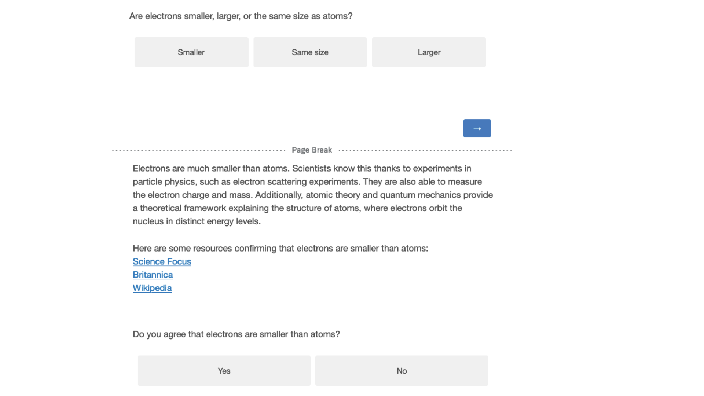

# Experiment 2 {#exp2}

In experiment 1, we tested whether participants would accept the scientific consensus on basic science facts. In most instances they did, but not always. In experiment 2, we wanted to test whether this reluctance was because of participants not trusting us as a source of consensual science knowledge. To do so, we added an explanation and sources to each consensus statement, instead of only stating the consensus. To better understand reasons for consensus rejection, after having answered all questions, we asked participants an open-ended question to explain why they rejected the consensus, for each question on which they did so. We also excluded the where do trees their materials from, as this question clearly seemed to be an outlier where most participants would get the answer wrong (see Appendix \@ref(exp1)).

Based on experiment 1, we formulated the following hypotheses:

**H1a: Higher trust in science is associated with more science knowledge?**

**H1b: Higher trust in science is associated with more acceptance of the scientific consensus, for participants who did not already know it?**

**H2a: Higher conspiracy thinking is associated with less science knowledge?**

**H2b: Higher conspiracy thinking is associated with less acceptance of the scientific consensus, for participants who did not already know it?**

We had the following research questions:

**RQ1: What is the average science knowledge score?**

**RQ2: When a participant’s answer does not match the consensus, how often do they change their mind and accept the consensus?**

**RQ3: What reasons do participants provide to justify their rejection of the scientific consensus?**

## Participants

We recruited 201 participants from the US via prolific. 11 participants failed our attention check, resulting in a final sample of `r exp2_descriptives$n_subj` participants (`r exp2_descriptives$gender$female$n` female, `r exp2_descriptives$gender$male$n` male; $age_\text{mean}$: `r exp2_descriptives$age$mean`, $age_\text{sd}$: `r exp2_descriptives$age$sd`, $age_\text{median}$: `r exp2_descriptives$age$median`). Since we did not have any prior assumptions on effect sizes and our analyses were descriptive, we did not do a power analysis.

## Procedure

The procedure was the same as in experiment 1, with the difference that, instead of just stating the scientific consensus, participants were presented with a short explanation which we wrote, partly based on explanations generated by ChatGPT, and three links to authoritative sources supporting the answer (Fig. \@ref(fig:exp2-stimulus-example).

## Materials

We relied on the same items as in experiment 1. The only difference was that we removed the question on trees.

\FloatBarrier

(ref:exp2-stimulus-example) Example of a science question, the scientific consensus and corresponding explanation and sources.

```{r exp2-stimulus-example, echo=FALSE, out.width= "100%", fig.align="left", fig.show="hold", fig.cap="(ref:exp2-stimulus-example)"}

```

## Results

As in experiment 1, we find a positive but small correlation between science knowledge and trust in science (H1a: r = `r exp2_descriptives$cor_trust_knowledge$estimate`, p `r exp2_descriptives$cor_trust_knowledge$p.value`) and a small negative correlation between science knowledge and conspiracy thinking (H2a: r = `r exp2_descriptives$cor_conspiracy_knowledge$estimate`, p `r exp2_descriptives$cor_conspiracy_knowledge$p.value`). By contrast to experiment 1, we conditioned on initially false answers when looking at the relationship of consensus acceptance with trust in science and conspiracy thinking, respectively. For trust in science, we find no statistically significant correlation (r = `r exp2_descriptives$false_answers_cor_trust_acceptance$estimate`, p `r exp2_descriptives$false_answers_cor_trust_acceptance$p.value`). For conspiracy thinking we find a small negative one (r = `r exp2_descriptives$false_answers_cor_conspiracy_acceptance$estimate`, p `r exp2_descriptives$false_answers_cor_conspiracy_acceptance$p.value`).


Confirming results from experiment 1, we find that the more people are knowledgeable about science and the more they tend to accept the scientific consensus even when they are not that knowledgeable in science, the more they tend to trust science. These correlations are relatively weak, which might be partly due to ceiling effects: As illustrated in Fig. \@ref(fig:exp2-plot), (i) most people do trust science, and (ii) that is true even among people with low knowledge or acceptance rates. In Appendix \@ref(exp2) we show that these results hold for our alternative measures of trust and conspiracy thinking. We also include more descriptive statistics, such as knowledge and acceptance by science questions.

Regarding RQ1, participants answered on average `r exp2_descriptives$means$knowledge_mean` (sd = `r exp2_descriptives$means$knowledge_sd`) of the questions correctly, and accepted the scientific consensus on average for `r exp2_descriptives$means$acceptance_mean` (sd = `r exp2_descriptives$means$acceptance_sd`) of the questions. Fig. \@ref(fig:exp2-conditional-acceptance) illustrates the relationship between knowledge and acceptance. In response to RQ2, in most cases (`r exp2_descriptives$conditional_acceptance$false$Yes$share`), participants readily accepted the scientific consensus after having initially given the wrong answer to a question. In very few cases (`r exp2_descriptives$conditional_acceptance$true$No$share`), participants who gave the correct response afterwards rejected the scientific consensus, thereby contradicting their own initial response.

```{r exp2-justifications}
exp2_justifications %>%
  group_by(category)%>%
  summarize(n = n(), 
            n_subjects = n_distinct(id)) %>%
  mutate(Share = n/sum(n)) %>%
  mutate_if(is.numeric, round, digits=3) %>% 
  mutate(Share = paste0(Share*100, "%")) %>% 
  arrange(desc(n)) %>% 
  select(category, n, Share, n_subjects) %>% 
  rename(Category = category,
         `N (instances)` = n, 
         `Share (instances)` = Share, 
         `N (unique participants)` = n_subjects
         ) %>% 
  apa_table(caption = "Justifications by category")
```

For RQ3, we got `r exp2_descriptives$justifications_n` answers from `r exp2_descriptives$justifications_n_participants` different participants to the open-ended questions on why they had rejected the scientific consensus on a particular question. Table \@ref(tab:exp2-justifications) summarizes these answers by five categories. All answers can be read in Appendix \@ref(exp2).

## Discussion

Similar to experiment 1, most people (i) do know and agree with the scientific consensus, and (ii) tend to accept the scientific consent even if they were not previously aware of it (i.e. answered the knowledge question wrongly). The share of these latter is considerably larger in experiment 2 (`r exp2_descriptives$conditional_acceptance$false$Yes$share`) than in experiment 1 (`r exp1_descriptives$conditional_acceptance$false$Yes$share`). While this could be just sampling variation, it might be that adding explanations and sources convinced people more than merely stating the consensus. We also show, again, that people with lower trust in science and who believe more in conspiracy theories tend to both know less about science and accept the scientific consensus less.

## Comparing items

### Conspiracy theories

Table \@ref(tab:exp2-correlation-conspiracy) shows the correlations of the three different scales assessing conspiracy thinking.

```{r exp2-correlation-conspiracy}
correlation_matrix <- exp2_wide %>%
  select(BCTI_avg, CMQ_avg, SICBS) %>% 
  rename(BCTI = BCTI_avg, 
         CMQ = CMQ_avg) %>% 
  cor()

apa_table(correlation_matrix, 
          caption = "Correlations of the three different scales assessing conspiracy thinking",
          placement = "h")
```

### Trust in science

Table \@ref(tab:exp2-correlation-trust) shows the correlations of the three different items measuring trust in science.

```{r exp2-correlation-trust}
correlation_matrix <- exp2_wide %>%
  select(wgm_sciencegeneral, wgm_scientists, pew) %>% 
  cor()

apa_table(correlation_matrix, 
          caption = "Correlations of the three different items measuring trust in science",
          placement = "h")
```

## Correlations with alternative measures

Table \@ref(tab:exp2-correlations-outcomes) shows the correlations between knowledge and acceptance, respectively, and outcome variables.

```{r}
# Standardize all variables. Linear regression on standardized variables is equivalent to correlation
standardized_variables <- exp2_wide %>% 
  select(avg_acceptance, avg_knowledge, BCTI_avg, CMQ_avg, SICBS, wgm_scientists, wgm_sciencegeneral, pew) %>% 
  mutate(across(everything(), ~scale(.x)))
```

```{r}
# List of variables
variables <- c("BCTI_avg", "CMQ_avg", "SICBS", "wgm_scientists", "wgm_sciencegeneral", "pew")

# Run regression for each variable and store results in a list
results_list_knowledge <- map(variables, ~ run_regression(standardized_variables, .x, "avg_knowledge"))
results_list_acceptance <- map(variables, ~ run_regression(standardized_variables, .x, "avg_acceptance"))
```

```{r exp2-correlations-outcomes}
# as data frame/output table
results <- bind_rows(list(results_list_knowledge, results_list_acceptance))
results %>% 
filter(term != "intercept") %>%
    mutate_if(is.numeric, round, digits = 2) %>% 
  # make a combined variable of estimate and p.value
  mutate(estimate = paste0(estimate, " (p", p.value, ")")) %>% 
  select(outcome, term, estimate) %>% 
  pivot_wider(names_from = term, 
              values_from = estimate) %>% 
  rename(`Correlation with knowledge` = avg_knowledge, 
         `Correlation with acceptance` = avg_acceptance, 
         ) %>% 
  mutate(outcome = case_when(outcome == "BCTI_avg" ~ "BCTI \n(main conspiracy measure)", 
                             outcome == "CMQ_avg" ~ "CMQ", 
                             outcome == "SICBS" ~ "SICBS", 
                             outcome == "wgm_scientists" ~ "WGM trust scientists",
                             outcome == "wgm_sciencegeneral" ~ "WGM trust general \n(main trust measure)",
                             outcome == "pew" ~ "PEW trust scientists",
                             )) %>% 
  apa_table(caption = "Correlations between knowledge and acceptance, respectively, and outcome variables")
```

## Results conditional on false responses

Table \@ref(tab:exp2-false-response-regression) shows the correlations between acceptance and outcome variables based on linear regression models on standardized values.

```{r}
# Standardize all variables. Linear regression on standardized variables is equivalent to correlation
standardized_variables <- exp2_false_knowledge %>% 
  select(avg_acceptance, BCTI_avg, CMQ_avg, SICBS, wgm_scientists, wgm_sciencegeneral, pew) %>% 
  mutate(across(everything(), ~scale(.x)))
```

```{r}
# Run regression for each variable and store results in a list
results_list <- setNames(map(variables, ~ run_regression(standardized_variables, .x, "avg_acceptance", return = "model")), variables)
```

```{r exp2-false-response-regression}
modelsummary(results_list, 
             stars = TRUE,
             caption = "Based on false response data only, correlations between acceptance and outcome variables based on linear regression models on standardized values") 
```

## By-question variation

```{r}
# calculate share
plot_data <- exp2_long %>% 
  group_by(subject) %>% 
  summarize(share_true = sum(knowledge == TRUE, na.rm = TRUE)/n(),
            share_accepted = sum(acceptance == "Yes", na.rm = TRUE)/n()) 
```

### Knowledge

(ref:exp2-questions-knowledge) Distribution of correct answers by question. 

```{r exp2-questions-knowledge, fig.cap="(ref:exp2-questions-knowledge)"}
# plot knowledge
ggplot(plot_data, aes(x = reorder(subject, share_true), y = share_true)) +
  geom_col() +
  scale_y_continuous(labels = scales::percent_format(), breaks = seq(0, 1, 0.1)) +
  labs(x = "Question", y = "Share of correct responses") +
  coord_flip()
```

### Acceptance

(ref:exp2-questions-acceptance) Distribution of consensus acceptance by question. 

```{r exp2-questions-acceptance, fig.cap="(ref:exp2-questions-acceptance)"}
# plot acceptance
ggplot(plot_data, aes(x = reorder(subject, share_accepted), y = share_accepted)) +
  geom_col() +
  scale_y_continuous(labels = scales::percent_format(), breaks = seq(0, 1, 0.1)) +
  labs(x = "Question", y = "Share of acceptance") +
  coord_flip()
```

## Trust in science

(ref:exp2-trust-scientists) Distribution of trust in scientists. 

```{r exp2-trust-scientists, fig.cap="(ref:exp2-trust-scientists)"}
# calculate share
plot_data <- exp2_wide %>% 
  group_by(wgm_scientists) %>% 
  summarize(n = n()) %>% 
  ungroup() %>% 
  mutate(share = n/sum(n)) %>% 
  rounded_numbers()

# plot knowledge
ggplot(plot_data, aes(x = wgm_scientists, y = share)) +
  geom_col() +
  scale_y_continuous(labels = scales::percent_format(), breaks = seq(0, 1, 0.1)) +
  labs(x = "Trust in science", y = "Share of participants") +
  geom_text(aes(label = paste0(round(share * 100, 1), "%")),
            position = position_dodge(width = 0.9),
            vjust = -0.5, size = 3) 
```

## Conspiracy thinking

### Distribution

(ref:exp2-conspiracy-distribution) Distribution of conspiracy thinking. 

```{r exp2-conspiracy-distribution, fig.cap="(ref:exp2-conspiracy-distribution)"}
# plot knowledge
ggplot(exp2_wide, aes(x = BCTI_avg)) +
  geom_histogram() +
  labs(x = "Average conspiracy thinking (BCTI)", y = "N")
```

### By-item variation

(ref:exp2-conspiracy-items) Distribution of conspiracy thinking by item. 

```{r exp2-conspiracy-items, fig.cap="(ref:exp2-conspiracy-items)"}
BCTI_data <- exp2_long %>% 
  # bring to long format
  pivot_longer(cols = BCTI_apollo:BCTI_evolution, 
               names_to = "BCTI_item", values_to = "score") %>% 
  select(id, c(starts_with("BCTI"), score)) %>% 
  group_by(BCTI_item) %>% 
  summarize(avg_score = mean(score, na.rm=TRUE)) %>% 
  ungroup()

ggplot(BCTI_data, aes(x = reorder(BCTI_item, avg_score), y = avg_score)) +
    geom_pointrange(aes(ymin = 1, ymax = avg_score),
                  # Make the lines a little thicker and the dots a little bigger
                  fatten = 2, size = 1) +
  scale_y_continuous(limits = c(1, 9), breaks = seq(1, 9, 1)) +
  labs(x = "Conspiracy item", y = "Average score") +
  coord_cartesian(ylim = c(1, 9)) +
  coord_flip()
```

## Reasons for consensus rejection

### By category

[To do]

### All raw answers

```{r exp2-reasons-rejection}
# store all variables
reasons_rejection <- c("electrons", "antibiotics", "continents", "sex", "lasers", 
               "orbit", "diamonds", "speed", "salt", "water")


table <- exp2_wide %>% 
  select(id, all_of(reasons_rejection)) %>% 
  pivot_longer(all_of(reasons_rejection), 
               names_to = "question",
               values_to = "answer") %>% 
  drop_na(answer) %>% 
  arrange(id)

kbl(table, booktabs = T, longtable = TRUE,
    caption = "Reasons for consensus rejection") %>%
  kable_paper(full_width = F) %>% 
  column_spec(1) %>%
  column_spec(2) %>%
  column_spec(3, width = "30em") 

```

## Additional plots

(ref:exp2-conditional-acceptance) Acceptance rates of scientific consensus, based on whether the initial response to the knowledge question was false or true.

```{r exp2-conditional-acceptance, fig.cap="(ref:exp2-conditional-acceptance)"}
plot_data <- exp2_long %>% 
  group_by(knowledge, acceptance) %>% 
  count() %>% 
  group_by(knowledge) %>% 
  mutate (share = n/sum(n)) %>% 
  mutate_if(is.numeric, round, digits = 3)

absolute_numbers <- plot_data %>% 
  group_by(knowledge) %>% 
  summarise(n = sum(n))


ggplot(plot_data, aes(x = knowledge, y = share, fill = acceptance)) +
  geom_col(position = "dodge") +
  scale_y_continuous(labels = scales::percent_format(), breaks = seq(0, 1, 0.1)) +
  geom_text(aes(label = paste0(round(share * 100, 1), "%")),
            position = position_dodge(width = 0.9),
            vjust = -0.5, size = 3) +
  scale_fill_viridis_d(option = "cividis") +
  labs(x = "Knowledge answer", fill = "Acceptance \nof consensus") +
  plot_theme  +
  geom_bracket(data = absolute_numbers,
               aes(xmin = as.numeric(factor(knowledge)) - 0.4, 
                   xmax = as.numeric(factor(knowledge)) + 0.4, 
                   y.position = 1.05, label =  paste0("n = ", n)),
               inherit.aes = FALSE,
               step.increase = 0)
```

(ref:exp2-plot-overview) **A** Shows the distribution of science knowledge (left) and acceptance of scientific consensus for participants who gave the wrong answer **B** Shows the relationship between trust in science and science knowledge/acceptance (if wrong at first, rounded to the first digit) of scientific consensus **C** Shows the relationship between conspiracy thinking and science knowledge/acceptance (if wrong at first) of scientific consensus
```{r exp2-plot-overview, fig.cap="(ref:exp2-plot-overview)", fig.height= 12, fig.width=12}

# Plot distributions of knowledge and acceptance and their mean
mean_value_knowledge <- mean(exp2_wide$avg_knowledge)
max_n <- max(table(exp2_wide$avg_acceptance))

knowledge_mean <- ggplot(exp2_wide, aes(x = avg_knowledge)) +
  geom_bar() + 
  geom_vline(xintercept = mean_value_knowledge, color = "red", linetype = "dashed") +
  geom_text(aes(x = mean_value_knowledge, y = 40, label = paste("Mean =", round(mean_value_knowledge, 2))), 
            vjust = -0.5, hjust = 1.2, check_overlap = TRUE) +
  scale_x_continuous(breaks = seq(0, 1, 0.1)) +
  scale_y_continuous(breaks = seq(0, max_n, 10)) +
  coord_cartesian(xlim = c(0, 1), 
                  ylim = c(0, max_n)) +
  labs(x = "Average science knowledge", 
       y = "N")

mean_value <- mean(exp2_wide$avg_acceptance)

acceptance_mean <- ggplot(exp2_wide, aes(x = avg_acceptance)) +
  geom_bar() + 
  geom_vline(xintercept = mean_value, color = "red", linetype = "dashed") +
  geom_text(aes(x = mean_value, y = 60, label = paste("Mean =", round(mean_value, 2))), 
            vjust = -0.5, hjust = 1.2, check_overlap = TRUE) +
  scale_x_continuous(breaks = seq(0, 1, 0.1)) +
  scale_y_continuous(breaks = seq(0, max_n, 10)) +
  coord_cartesian(xlim = c(0, 1), 
                  ylim = c(0, max_n)) +
  labs(x = "Average consensus acceptance", 
       y = "N")

# Trust in science plots
plot_data <- exp2_wide %>% 
  group_by(wgm_sciencegeneral, avg_knowledge) %>% 
  summarise(n = n())

trust_knowledge <- ggplot(plot_data, aes(x = avg_knowledge, y = wgm_sciencegeneral, fill = n)) +
  geom_tile() +  # Add black border around tiles for better visibility
  geom_jitter(inherit.aes = FALSE, data = exp2_wide, aes(x = avg_knowledge, y = wgm_sciencegeneral),
              width = 0.03, height = 0.08) +  # Scatter points within each tile
  scale_fill_viridis_c(option = "plasma") +  # Use Viridis color scale (Plasma)
  scale_x_continuous(breaks = seq(0, 1, 0.1)) +
  coord_cartesian(xlim = c(0, 1)) +
  scale_y_continuous(breaks = 1:5) +
  labs(x = "Average science knowledge", 
       y = "Trust in science", 
       fill = "N")

plot_data <- exp2_wide %>% 
  group_by(wgm_sciencegeneral, avg_acceptance) %>% 
  summarise(n = n())


trust_acceptance <- ggplot(plot_data, aes(x = avg_acceptance, y = wgm_sciencegeneral, fill = n)) +
  geom_tile() +  
  geom_jitter(inherit.aes = FALSE, data = exp2_wide, aes(x = avg_acceptance, y = wgm_sciencegeneral),
              width = 0.03, height = 0.08) + 
  scale_fill_viridis_c(option = "plasma") + 
  scale_x_continuous(breaks = seq(0, 1, 0.1)) +
  coord_cartesian(xlim = c(0, 1)) +
  scale_y_continuous(breaks = 1:5) +
  labs(x = "Average consensus Acceptance", 
       y = "Trust in science", 
       fill = "N") +
  theme(legend.position = "top")

# Conspiracy Thinking plots

conspiracy_knowledge <- ggplot(exp2_wide, aes(x = avg_knowledge, y = BCTI_avg)) +
  geom_point() +
  geom_smooth(method = "lm") +
  scale_x_continuous(breaks = seq(0, 1, 0.1)) +
  scale_y_continuous(breaks = 1:9) +
  coord_cartesian(xlim = c(0, 1), 
                  ylim = c(0, 9)) +
  labs(x = "Average science knowledge", 
       y = "Average conspiracy thinking")

conspiracy_acceptance <- ggplot(exp2_wide, aes(x = avg_acceptance, y = BCTI_avg)) +
  geom_point() +
  geom_smooth(method = "lm") +
  scale_x_continuous(breaks = seq(0, 1, 0.1)) +
  scale_y_continuous(breaks = 1:9) +
  coord_cartesian(xlim = c(0, 1), 
                  ylim = c(0, 9)) +
  labs(x = "Average consensus acceptance", 
       y = "Average conspiracy thinking") +
  theme(legend.position = "top")

# Combine plots

# distributions
distributions <- ggarrange(knowledge_mean + 
                             rremove("xlab") , 
                           acceptance_mean + 
                             rremove("xlab") +
                             rremove("ylab")) 

# trust
trust <- ggarrange(trust_knowledge + 
                             rremove("xlab") +
                             guides(fill = "none") +
                             labs(caption = NULL) , 
                           trust_acceptance + 
                             rremove("xlab") +
                             rremove("ylab"), 
                   common.legend = TRUE) 

# conspiracy
conspiracy <- ggarrange(conspiracy_knowledge, 
                           conspiracy_acceptance + 
                             rremove("ylab"), 
                   common.legend = TRUE) 


# common plot
patchwork <- (distributions / trust / conspiracy) + 
  plot_annotation(tag_levels = 'A')  

patchwork

```


