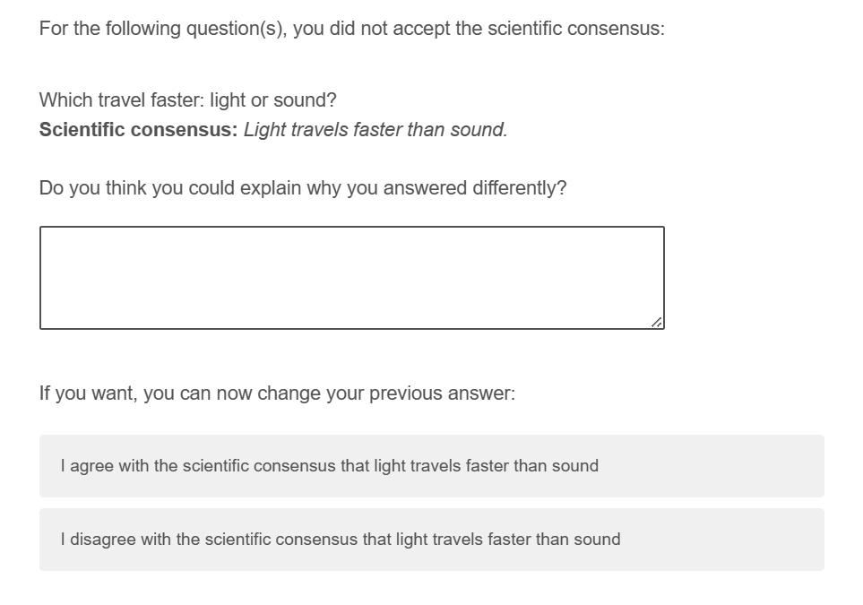

# Study 3 {#exp3}

Study 3 is essentially a replication-–with some minor modifications-–of study 2, but on a different type of sample. Both study 1 and 2 were run on convenience samples. For study 3, we recruited a sample of people holding anti-vaccination beliefs (see below). By contrast to study 2, after asking participants an open question about why they did not accept the consensus (in cases where they didn't), we provide them with an explicit opportunity to change their answer (Fig. \@ref(fig:exp3-explanation-example)). Based on the answers to the open-ended questions, we also pre-registered a categorization scheme of reasons why people rejected the consensus. Finally, we also ask participants about why they agree with the scientific consensus on certain questions, in case they do. We want to know if participants perceive that this is because of trust, or other factors.

As for study 2 (but without conditioning on wrong answers, as we did in study 1), we had the following hypotheses:

**H1a: Higher trust in science is associated with more science knowledge?**

**H1b: Higher trust in science is associated with more acceptance of the scientific consensus.**

**H2a: Higher conspiracy thinking is associated with less science knowledge?**

**H2b: Higher conspiracy thinking is associated with less acceptance of the scientific consensus.**

We had the following research questions:

**RQ1: What is the average science knowledge score?**

**RQ2: What is the average acceptance of the scientific consensus**

**RQ3: What reasons do participants provide to justify their rejection of the scientific consensus?**

**RQ4: In case they agree with the scientific consensus, do people feel that this is because of trust?**

## Participants

We recruited a sample of participants holing vaccine-skeptic beliefs. Prolific Academic allows to filter out participants who have given specific answers to certain questions. We selected three available questions: 1. "Participants were asked the following question: Please describe your attitudes towards the COVID-19 (Coronavirus) vaccines: [For (I feel positively about the vaccines); Against (I feel negatively about the vaccines); Neutral (I don't have strong opinions either way); Prefer not to say"]. We selected particpants who answered "Against". 2. "Participants were asked the following question: Have you received a coronavirus (COVID-19) vaccination? [Yes (at least one dose); No; Prefer not to answer]". We select only people who answered "No". 3. "Participants were asked the following question: On a scale from 1-7, please rate to what extent you agree with the following statement: I believe that scheduled immunizations are safe for children. [1 (TOTALLY DISAGREEE); 2 (DISAGREE); 3 (SOMEWHAT DISAGREE); 4 (NEITHER AGREE NOR DISAGREE); 5 (SOMEWHAT AGREE); 6 (AGREE); 7 (TOTALLY AGREE); Rather not say"]. We select only people who answered "1", "2", or "3". 

Based on these criteria, we recruited 200 participants from the US via prolific, of which none failed our attention check, resulting in a final sample of `r exp3_descriptives$n_subj` participants (`r exp3_descriptives$gender$female$n` female, `r exp3_descriptives$gender$male$n` male; $age_\text{mean}$: `r exp3_descriptives$age$mean`, $age_\text{sd}$: `r exp3_descriptives$age$sd`, $age_\text{median}$: `r exp3_descriptives$age$median`). Since we did not have any prior assumptions on effect sizes and our analyses were descriptive, we did not do a power analysis.

However, due to a randomization mistake for our outcomes, participant answered only two of the three outcome measure blocs (trust in science, conspiracy thinking, and reason for accepting consensus). This leaves us with reduced sample sizes for all analyses concerning these outcomes (N = `r exp3_descriptives$n_subject_by_outcome$wgm_sciencegeneral` for trust in science, N = `r exp3_descriptives$n_subject_by_outcome$BCTI_avg` for conspiracy measures, N = `r exp3_descriptives$n_subject_by_outcome$reason_agreement` for reason for accepting consensus).

## Procedure

The procedure was mostly the same as in study 2. In addition, after each open-ended question on cases where participants rejected the scientific consensus, participants were also asked if they want to change their answer and accept the scientific consensus. Finally, at the end of the survey, we asked participants: "For the questions in which you agreed with the scientific consensus, would you say that...?" The answer options were: (i) "You mostly agree with the consensus because, on that question, you trust scientists", (ii) "You mostly agree with the consensus because you have been able to independently verify it", and (iii) "Other", with a text box for participants to explain. Participants who selected “You mostly agree with the consensus because you have been able to independently verify it”, were asked the open-ended follow-up question: "Could you please tell us how you independently verified the information?".

## Materials

\FloatBarrier

(ref:exp3-explanation-example) Example of an explanation question and the opportunity to change the previous answer.

```{r exp3-explanation-example, echo=FALSE, out.width= "50%", fig.align="center", fig.show="hold", fig.cap="(ref:exp3-explanation-example)"}

```

Table \@ref(tab:exp3-knowledge-items) shows all questions, their scientifically consensual answer, and their source. All but two questions were selected from existing science knowledge questionnaires. We tried to select non-political questions.

```{r exp3-knowledge-items}
items <- read_csv("exp_3/materials/overview_questions.csv") %>% 
  mutate(id = 1:nrow(.)) %>% 
  select(id, "Question", "Scientific consensus (Study 1)", "Explanation (Study 2 & 3)") 

# Create the basic table
if (knitr::is_latex_output() || knitr::is_html_output()) {
  # For LaTeX or HTML: Use kbl, column_spec, and kable_styling
  table_output <- items %>%
    kbl(
      booktabs = TRUE, 
      longtable = TRUE,
      caption = "Science knowledge items", 
      full_width = TRUE
    ) %>%
    kableExtra::kable_styling(font_size = 8) %>%
    kableExtra::column_spec(1, width = "1em") %>%
    kableExtra::column_spec(2, width = "10em") %>%
    kableExtra::column_spec(3, width = "10em") %>%
    kableExtra::column_spec(4, width = "23em")
} else {
  # For Word: Use flextable for better Word compatibility
  table_output <- flextable::flextable(items) %>%
    flextable::set_caption(caption = "Science knowledge items") %>%
    flextable::autofit() %>%
    flextable::width(j = 1, width = 0.8) %>%
    flextable::width(j = 2, width = 3) %>%
    flextable::width(j = 3, width = 3) %>%
    flextable::width(j = 4, width = 6) # Adjust column widths as needed
}

# Display the table
table_output
```

## Results

As in study 1 and 2, we find that participants answered on average `r exp3_descriptives$means$knowledge_mean` (sd = `r exp3_descriptives$means$knowledge_sd`) of the questions correctly (RQ1), and initially accepted the scientific consensus on average for `r exp3_descriptives$means$acceptance_initial_mean` (sd = `r exp3_descriptives$means$acceptance_initial_sd`) of the questions (RQ2). The acceptance rate is even higher when accounting for opinion revisions towards acceptance of the consensus, after initial rejection (`r exp3_descriptives$means$acceptance_mean`, sd = `r exp3_descriptives$means$acceptance_sd`).

In most cases (`r exp3_descriptives$conditional_acceptance$false$acceptance_initial$Yes$share`), participants readily accepted the scientific consensus right after having given the wrong answer to a question. After providing the chance to revise the initial consensus rejection, this share is even larger (`r exp3_descriptives$conditional_acceptance$false$acceptance$Yes$share`). In very few cases (`r exp3_descriptives$conditional_acceptance$true$acceptance_initial$No$share`), participants who initially gave the correct response afterwards rejected the scientific consensus right after, thereby contradicting their own initial response. This share drops slightly after providing the chance to revise the initial consensus rejection (`r exp3_descriptives$conditional_acceptance$true$acceptance$No$share`).

For all correlations, we include opinion revisions for measuring consensus acceptance. We find no statistically significant correlation between science knowledge and trust in science (r = `r exp3_descriptives$cor_trust_knowledge$estimate`, p `r exp3_descriptives$cor_trust_knowledge$p.value`), but a samll positive correlation between acceptance of scientific consensus and trust in science (r = `r exp3_descriptives$cor_trust_acceptance$estimate`, p `r exp3_descriptives$cor_trust_acceptance$p.value`). Again, these findings might be partly due to ceiling effects: (i) most people do trust science, and (ii) that is true even among people with low knowledge or acceptance rates. We find no statistically significant correlation between conspiracy thinking and science knowledge (r = `r exp3_descriptives$cor_conspiracy_knowledge$estimate`, p `r exp3_descriptives$cor_conspiracy_knowledge$p.value`), and between conspiracy thinking and acceptance of scientific consensus (r = `r exp3_descriptives$cor_conspiracy_acceptance$estimate`, p `r exp3_descriptives$cor_conspiracy_acceptance$p.value`).

For RQ3, we got `r exp3_descriptives$justifications_n` answers from `r exp3_descriptives$justifications_n_participants` different participants to the open-ended questions on why they had rejected the scientific consensus on a particular question. Table \@ref(tab:exp3-justifications) summarizes these answers by five categories.

All answers can be read in the below.

```{r exp3-justifications}
exp3_justifications %>%
  group_by(category)%>%
  summarize(n = n(), 
            n_subjects = n_distinct(id)) %>%
  mutate(Share = n/sum(n)) %>%
  mutate_if(is.numeric, round, digits=3) %>% 
  mutate(Share = paste0(Share*100, "%")) %>% 
  arrange(desc(n)) %>% 
  select(category, n, Share, n_subjects) %>% 
  rename(Category = category,
         `N (instances)` = n, 
         `Share (instances)` = Share, 
         `N (unique participants)` = n_subjects
         ) %>% 
  apa_table(caption = "Justifications by category")
```

For RQ4, we had `r exp3_descriptives$acceptance_n` participants answering the question. Of these `r exp3_descriptives$acceptance_by_reason[["trust in scientists"]]$share` said they accepted the scientific consensus because they trust scientists on this question, while `r exp3_descriptives$acceptance_by_reason[["independent verification"]]$share` said they independently verified the fact. `r exp3_descriptives$acceptance_by_reason[["other"]]$share` answered with other "other" and gave an open-ended explanation (see below for all open-ended answers).

We also asked all `r exp3_descriptives$reason_followup_n` participants who answered that they had independently verified the answer to explain how they did so. The open-ended answers are listed below.

## Comparing items

### Conspiracy theories

Table \@ref(tab:exp3-correlation-conspiracy) shows the correlations of the three different scales assessing conspiracy thinking.

```{r exp3-correlation-conspiracy}
correlation_matrix <- exp3_wide %>%
  select(BCTI_avg, CMQ_avg, SICBS) %>% 
  rename(BCTI = BCTI_avg, 
         CMQ = CMQ_avg) %>% 
  cor()

apa_table(correlation_matrix, 
          caption = "Correlations of the three different scales assessing conspiracy thinking",
          placement = "h")
```

### Trust in science

Table \@ref(tab:exp3-correlation-trust) shows the correlations of the three different items measuring trust in science.

```{r exp3-correlation-trust}
correlation_matrix <- exp3_wide %>%
  select(wgm_sciencegeneral, wgm_scientists, pew) %>% 
  cor(use = "complete.obs")

apa_table(correlation_matrix, 
          caption = "Correlations of the three different items measuring trust in science",
          placement = "h")
```

## Correlations with alternative measures

Table \@ref(tab:exp3-correlations-outcomes) shows the correlations between knowledge and acceptance, respectively, and outcome variables.

```{r}
# Standardize all variables. Linear regression on standardized variables is equivalent to correlation
standardized_variables <- exp3_wide %>% 
  select(avg_acceptance, avg_knowledge, BCTI_avg, CMQ_avg, SICBS, wgm_scientists, wgm_sciencegeneral, pew) %>% 
  mutate(across(everything(), ~scale(.x)))
```

```{r}
# List of variables
variables <- c("BCTI_avg", "CMQ_avg", "SICBS", "wgm_scientists", "wgm_sciencegeneral", "pew")

# Run regression for each variable and store results in a list
results_list_knowledge <- map(variables, ~ run_regression(standardized_variables, .x, "avg_knowledge"))
results_list_acceptance <- map(variables, ~ run_regression(standardized_variables, .x, "avg_acceptance"))
```

```{r exp3-correlations-outcomes}
# as data frame/output table
results <- bind_rows(list(results_list_knowledge, results_list_acceptance))
results %>% 
filter(term != "intercept") %>%
    mutate_if(is.numeric, round, digits = 2) %>% 
  # make a combined variable of estimate and p.value
  mutate(estimate = paste0(estimate, " (p", p.value, ")")) %>% 
  select(outcome, term, estimate) %>% 
  pivot_wider(names_from = term, 
              values_from = estimate) %>% 
  rename(`Correlation with knowledge` = avg_knowledge, 
         `Correlation with acceptance` = avg_acceptance, 
  ) %>% 
  mutate(outcome = case_when(outcome == "BCTI_avg" ~ "BCTI (main conspiracy measure)", 
                             outcome == "CMQ_avg" ~ "CMQ", 
                             outcome == "SICBS" ~ "SICBS", 
                             outcome == "wgm_scientists" ~ "WGM trust scientists",
                             outcome == "wgm_sciencegeneral" ~ "WGM trust general (main trust measure)",
                             outcome == "pew" ~ "PEW trust scientists",
                             )) %>% 
  apa_table(caption = "Correlations between knowledge and acceptance, respectively, and outcome variables")
```

## Results conditional on false responses

Table \@ref(tab:exp3-false-response-regression) shows the correlations between acceptance and outcome variables based on linear regression models on standardized values.

```{r}
# Standardize all variables. Linear regression on standardized variables is equivalent to correlation
standardized_variables <- exp3_false_knowledge %>% 
  select(avg_acceptance, BCTI_avg, CMQ_avg, SICBS, wgm_scientists, wgm_sciencegeneral, pew) %>% 
  mutate(across(everything(), ~scale(.x)))
```

```{r}
# Run regression for each variable and store results in a list
results_list <- setNames(map(variables, ~ run_regression(standardized_variables, .x, "avg_acceptance", return = "model")), variables)
```

```{r exp3-false-response-regression}
# modelsummary(results_list, 
#              stars = TRUE,
#              caption = "Based on false response data only, correlations between acceptance and outcome variables based on linear regression models on standardized values", 
#              output = "kableExtra") 

# Generate the table with the correct format
if (knitr::is_latex_output() || knitr::is_html_output()) {
  modelsummary(results_list,
               stars = TRUE,
               caption = "Based on false response data only, correlations between acceptance and outcome variables based on linear regression models on standardized values",
               output = "kableExtra")

} else {
  modelsummary(results_list,
               stars = TRUE,
               caption = "Based on false response data only, correlations between acceptance and outcome variables based on linear regression models on standardized values",
               output = "flextable") %>%
    flextable::set_caption("Based on false response data only, correlations between acceptance and outcome variables based on linear regression models on standardized values") %>%
    flextable::autofit() %>%  # Ensure proper column width
    flextable::theme_booktabs()  # Use a professional-looking theme
  
}
```


(ref:exp3-plot-overview) Summary plot for Study 3. **A** Shows the distribution of science knowledge (left) and acceptance of scientific consensus for participants who gave the wrong answer **B** Shows the relationship between trust in science and science knowledge/acceptance (if wrong at first, rounded to the first digit) of scientific consensus **C** Shows the relationship between conspiracy thinking and science knowledge/acceptance (if wrong at first) of scientific consensus

```{r exp3-plot-overview, fig.cap="(ref:exp3-plot-overview)", fig.height= 12, fig.width=12}
# Plot distributions of knowledge and acceptance and their mean

mean_value_knowledge <- mean(exp3_wide$avg_knowledge)
max_n <- max(table(exp3_wide$avg_acceptance))

knowledge_mean <- ggplot(exp3_wide, aes(x = avg_knowledge)) +
  geom_bar() + 
  geom_vline(xintercept = mean_value_knowledge, color = "red", linetype = "dashed") +
  geom_text(aes(x = mean_value_knowledge, y = 40, label = paste("Mean =", round(mean_value_knowledge, 2))), 
            vjust = -0.5, hjust = 1.2, check_overlap = TRUE) +
  scale_x_continuous(breaks = seq(0, 1, 0.1)) +
  scale_y_continuous(breaks = seq(0, max_n, 10)) +
  coord_cartesian(xlim = c(0, 1), 
                  ylim = c(0, max_n)) +
  labs(x = "Average science knowledge", 
       y = "N")

mean_value <- mean(exp3_wide$avg_acceptance)

acceptance_mean <- ggplot(exp3_wide, aes(x = avg_acceptance)) +
  geom_bar() + 
  geom_vline(xintercept = mean_value, color = "red", linetype = "dashed") +
  geom_text(aes(x = mean_value, y = 60, label = paste("Mean =", round(mean_value, 2))), 
            vjust = -0.5, hjust = 1.2, check_overlap = TRUE) +
  scale_x_continuous(breaks = seq(0, 1, 0.1)) +
  scale_y_continuous(breaks = seq(0, max_n, 10)) +
  coord_cartesian(xlim = c(0, 1), 
                  ylim = c(0, max_n)) +
  labs(x = "Average consensus acceptance", 
       y = "N")

# Trust in science plots
plot_data <- exp3_wide %>% 
  group_by(wgm_sciencegeneral, avg_knowledge) %>% 
  summarise(n = n())

trust_knowledge <- ggplot(plot_data, aes(x = avg_knowledge, y = wgm_sciencegeneral, fill = n)) +
  geom_tile() +  # Add black border around tiles for better visibility
  geom_jitter(inherit.aes = FALSE, data = exp3_wide, aes(x = avg_knowledge, y = wgm_sciencegeneral),
              width = 0.03, height = 0.08) +  # Scatter points within each tile
  scale_fill_viridis_c(option = "plasma") +  # Use Viridis color scale (Plasma)
  scale_x_continuous(breaks = seq(0, 1, 0.1)) +
  coord_cartesian(xlim = c(0, 1)) +
  scale_y_continuous(breaks = 1:5) +
  labs(x = "Average science knowledge", 
       y = "Trust in science", 
       fill = "N")

plot_data <- exp3_wide %>% 
  group_by(wgm_sciencegeneral, avg_acceptance) %>% 
  summarise(n = n())


trust_acceptance <- ggplot(plot_data, aes(x = avg_acceptance, y = wgm_sciencegeneral, fill = n)) +
  geom_tile() +  
  geom_jitter(inherit.aes = FALSE, data = exp3_wide, aes(x = avg_acceptance, y = wgm_sciencegeneral),
              width = 0.03, height = 0.08) + 
  scale_fill_viridis_c(option = "plasma") + 
  scale_x_continuous(breaks = seq(0, 1, 0.1)) +
  coord_cartesian(xlim = c(0, 1)) +
  scale_y_continuous(breaks = 1:5) +
  labs(x = "Average consensus Acceptance", 
       y = "Trust in science", 
       fill = "N") +
  theme(legend.position = "top")

# Conspiracy Belief plot

conspiracy_knowledge <- ggplot(exp3_wide, aes(x = avg_knowledge, y = BCTI_avg)) +
  geom_point() +
  geom_smooth(method = "lm") +
  scale_x_continuous(breaks = seq(0, 1, 0.1)) +
  scale_y_continuous(breaks = 1:9) +
  coord_cartesian(xlim = c(0, 1), 
                  ylim = c(0, 9)) +
  labs(x = "Average science knowledge", 
       y = "Average conspiracy thinking")

conspiracy_acceptance <- ggplot(exp3_wide, aes(x = avg_acceptance, y = BCTI_avg)) +
  geom_point() +
  geom_smooth(method = "lm") +
  scale_x_continuous(breaks = seq(0, 1, 0.1)) +
  scale_y_continuous(breaks = 1:9) +
  coord_cartesian(xlim = c(0, 1), 
                  ylim = c(0, 9)) +
  labs(x = "Average consensus acceptance", 
       y = "Average conspiracy thinking") +
  theme(legend.position = "top")

# Combine plots

# distributions
distributions <- ggarrange(knowledge_mean + 
                             rremove("xlab") , 
                           acceptance_mean + 
                             rremove("xlab") +
                             rremove("ylab")) 

# trust
trust <- ggarrange(trust_knowledge + 
                             rremove("xlab") +
                             guides(fill = "none") +
                             labs(caption = NULL) , 
                           trust_acceptance + 
                             rremove("xlab") +
                             rremove("ylab"), 
                   common.legend = TRUE) 

# conspiracy
conspiracy <- ggarrange(conspiracy_knowledge, 
                           conspiracy_acceptance + 
                             rremove("ylab"), 
                   common.legend = TRUE) 


# common plot
patchwork <- (distributions / trust / conspiracy) + 
  plot_annotation(tag_levels = 'A')  

patchwork
```


