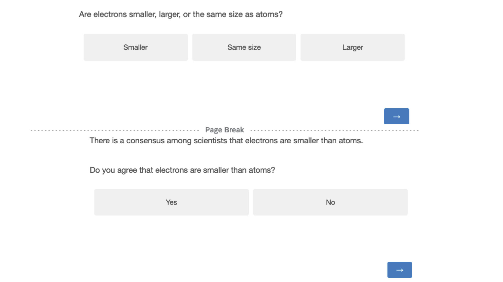

```{r setup, include=FALSE}
knitr::opts_chunk$set(echo = FALSE, message = FALSE)
```

```{r packages, message=FALSE, echo=FALSE, include=FALSE}
library(tidyverse)     # create plots with ggplot, manipulate data, etc.
library(broom.mixed)   # convert regression models into nice tables
library(modelsummary)  # combine multiple regression models into a single table
library(lme4)          # model specification / estimation 
library(lmerTest)      # provides p-values in the output
library(ggpubr)        # stile feature of ggplot
library(gghalves)      # do special plots in ggplot
library(kableExtra)    # for tables
library("grid")        # for image plots   
library("gridExtra")   # for image plots
library("png")         # for image plots
```

```{r, include=FALSE, message=FALSE}
# read in data from power simulation


```

# Introduction

Anti-vax people or climate skepticists are often conceived of as simply anti-science. But would these people deny that water is made of molecules containing one oxygen and two hydrogen atoms, and that its chemical formula therefore is H2O? We suspect that everyone (or nearly everyone), including people who hold-anti science conspiracy beliefs, trusts basic science, at least when it doesn’t conflict with their specific beliefs.

# Data collection

No data has been collected yet.

# Procedure

After providing their consent to participate in the study, participants are given an attention check:

> *While watching the television, have you ever had a fatal heart attack?* [1-6; 1 = Never, 6 = Often]

Participants then read the following instructions:

> *We will ask you 11 questions about science. After each question, we will provide you with the scientifically consensual answer and ask whether you accept it.*

Next, participants answer a set of 11 basic science questions, all but two extracted from existing science knowledge questionnaires. After each question, participants will be presented with an answer reflecting the scientific consensus. Participants are asked to choose whether they accept the answer or not, before proceeding to the next question. Figure \@ref(fig:stimulus-example) displays the survey for an example science question. Table \@ref(tab:knowledge) shows all included questions, their scientifically consensual answer, and their source.

(ref:stimulus-example) Example of a science question, the scientific consensus and the corresponding acceptance question.

```{r stimulus-example, echo=FALSE, out.width= "100%", fig.align="left", fig.show="hold", fig.cap="(ref:stimulus-example)"}

```

After that, participants answer questions on conspiracy thinking and trust in science (see next section).

# Materials

## Knowledge Items

```{r knowledge}
items <- read_csv("materials/knowledge_items.csv") %>% 
  mutate(id = 1:nrow(.)) %>% 
  select(id, Question, `Scientific consensus`, `Reference(s)`)

# Output the table
kbl(items, booktabs = T, longtable = TRUE,
    caption = "Science knowledge items") %>%
  kable_paper(full_width = T) %>% 
  column_spec(1, width = "1em") %>%
  column_spec(2, width = "10em") %>%
  column_spec(3, width = "10em") %>%
  column_spec(4, width = "15em") 
```

## Conspiracy scales

We rely on three scales:

1.  The conspiracy mentality questionnaire (CMQ) by @bruderMeasuringIndividualDifferences2013 :

I think that . . .

-   ... many very important things happen in the world, which the public is never informed about. - politicians usually do not tell us the true motives for their decisions.
-   ... government agencies closely monitor all citizens.
-   ... events which superficially seem to lack a connection are often the result of secret activities.
-   ... there are secret organizations that greatly influence political decisions.

[0% - 100%; 0 = certainly not, 100 = certain]

2.  The Single Item Conspiracy Beliefs Scale (SICBS) by @lantianMeasuringBeliefConspiracy2016 :

-   I think that the official version of the events given by the authorities very often hides the truth. [1-9; 1 = Completely false, 5 = Unsure, 9 = Completely true]

3.  A selection of science/health related conspiracy theories from the Belief in Conspiracy Theory Inventory (BCTI) by @pennycookOverconfidentlyConspiratorialConspiracy2022, displayed in table \@ref(tab:conspiracy).

```{r conspiracy, echo=FALSE}
# Create the data frame
items <- c(
  "The Apollo moon landings never happened and were staged in a Hollywood film studio.",
  "A cure for cancer was discovered years ago, but this has been suppressed by the pharmaceutical industry and the U.S. Food and Drug Administration (FDA).",
  "The spread of certain viruses and/or diseases is the result of the deliberate, concealed efforts of vested interests.",
  "The claim that the climate is changing due to emissions from fossil fuels is a hoax perpetrated by corrupt scientists who want to spend more taxpayer money on climate research.",
  "The Earth is flat (not spherical) and this fact has been covered up by scientists and vested interests.",
  "There is a causal link between vaccination and autism that has been covered up by the pharmaceutical industry.",
  "In the 1950s and 1960s more than 100 million Americans received a polio vaccine contaminated with a potentially cancer-causing virus.",
  "Proof of alien contact is being concealed from the public.",
  "Hydroxychloroquine has been demonstrated to be a safe and effective treatment of COVID and this information is being suppressed.",
  "Dinosaurs never existed, evolution is not real, and scientists have been faking the fossil record.")

data <- data.frame(id = 1:length(items), items = items)

# Output the table
kbl(data, booktabs = T, longtable = T, col.names = NULL, 
    caption = "Conspiracy items") %>%
  kable_paper(full_width = F,) %>%
  column_spec(1) %>%
  column_spec(2, width = "30em")
```

## Trust in science

We rely on three items. The first two were selected from the Wellcome Global Monitor survey. The third one is from the Pew research center and has recently been used by a world-wide many labs study [@colognaTrustScientistsTheir2024]. We consider "acting in the best interest of the public" as a sub-aspect of trust, and include this question mainly to be able to compare our sample to a wide ranging global sample.

-   How much do you trust scientists in this country? Do you trust them a lot, some, not much, or not at all? [1 = Not at all, 2 = Not much, 3 = Some, 4 = A lot]

-   In general, would you say that you trust science a lot, some, not much, or not at all? [1 = Not at all, 2 = Not much, 3 = Some, 4 = A lot]

-   How much confidence do you have in scientists to act in the best interests of the public? [1-5; 1 = No confidence at all, 5 = A great deal of confidence]

# Research questions

-   **RQ1: What is the average science knowledge score (1)?**

We will report the average percentage of questions answered correctly. We will look at the pooled average and the distribution of participant averages.

-   **RQ2: What is the average acceptance of the scientific consensus (2)?**

Similar to RQ1, we will report the average acceptance rate of the scientific consensus. We will look at the pooled average and the distribution of participant averages.

-   **RQ3: What is the relationship between trust in science and, respectively, (1) and (2)?**

We will regress trust in science on the average knowledge and acceptance per participant.

If they correlate highly, we will use the average of the two Wellcome Global Monitor trust questions. If not, we will focus on the "How much do you trust science?" question.

We will run a robustness check on the Pew question.

-   **RQ4: What is the relationship between conspiracy thinking and, respectively, (1) and (2)?**

We will proceed just as for RQ3, but with conspiracy thinking as outcome, instead of trust.

To measure conspiracy thinking, we will use the average score of the Conspiracy Theory Inventory (BCTI) by @pennycookOverconfidentlyConspiratorialConspiracy2022.

As robustness checks, we will run the same analysis separately for the two other conspiracy scales (also averaging across all items).

We will also check how well the three conspiracy scales correlate.

# Participants

We will recruit 200 participants from the US. 

# Exclusions

We will exclude participants who do not answer “Never” in the attention check.

# References
