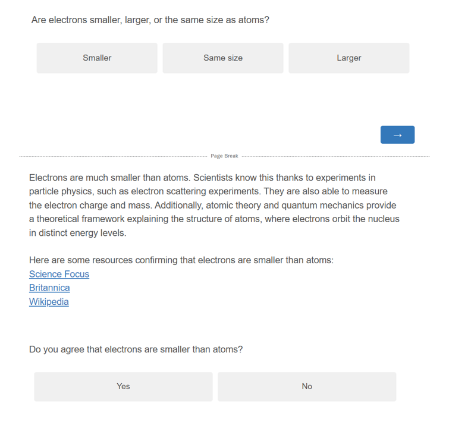

```{r setup, include=FALSE}
knitr::opts_chunk$set(echo = FALSE, message = FALSE)
```

```{r packages, message=FALSE, echo=FALSE, include=FALSE}
library(tidyverse)     # create plots with ggplot, manipulate data, etc.
library(broom.mixed)   # convert regression models into nice tables
library(modelsummary)  # combine multiple regression models into a single table
library(lme4)          # model specification / estimation 
library(lmerTest)      # provides p-values in the output
library(ggpubr)        # stile feature of ggplot
library(gghalves)      # do special plots in ggplot
library(kableExtra)    # for tables
library("grid")        # for image plots   
library("gridExtra")   # for image plots
library("png")         # for image plots
```


# Introduction

In a first study (https://osf.io/8utsj/) we tested whether participants would accept the scientific consensus on basic science facts. Most participants did, but not for all the questions. In this survey, we make two main adjustments to further investigate rejection of consensus: (i) we add a longer explanation and sources, instead of only stating the consensus. If it was the case that participants did not mistrust the science, but us the experimenters, this should increase acceptance; (ii) every time a participant rejects the scientific consensus, we ask them an open-ended question to explain why they did so. We also remove one science question that we had added ourselves (on where trees mainly draw there materials from to grow; answer: air), because the results were very different compared to other questions, suggesting the question might have been confusing.

# Data collection

No data has been collected yet.

# Procedure

After providing their consent to participate in the study, participants are given an attention check:

> *While watching the television, have you ever had a fatal heart attack?* [1-6; 1 = Never, 6 = Often]

Participants then read the following instructions:

> *We will ask you 10 questions about science. After each question, we will provide you with the scientifically consensual answer and ask whether you accept it.*

Next, participants answer a set of 10 basic science questions, all but one extracted from existing science knowledge questionnaires. After each question, participants will be presented with an answer reflecting the scientific consensus, along with an explanation which we wrote, partly based on explanations generated by ChatGPT, and three links to authoritative sources supporting the answer. Participants are asked to choose whether they accept the answer or not, before proceeding to the next question. Figure 1 displays the survey for an example science question. Table 1 shows all included questions, their scientifically consensual answer, the explanations, and their source.


(ref:stimulus-example) Example of a science question, the explanation with references and the corresponding acceptance question.

```{r stimulus-example, echo=FALSE, out.width= "100%", fig.align="center", fig.show="hold", fig.cap="(ref:stimulus-example)"}

```

After that, participants answer questions on conspiracy thinking and trust in science (see next section).

# Materials

## Knowledge Items

```{r knowledge}
items <- read_csv("materials/knowledge_items_2.csv") %>% 
  mutate(id = 1:nrow(.)) %>% 
  select(id, Question, `Scientific consensus`, `Explanation`)

# Output the table
kbl(items, booktabs = T, longtable = TRUE,
    caption = "Science knowledge items", linesep = "\\addlinespace") %>%
  kable_paper(full_width = T) %>% 
  column_spec(1, width = "1em") %>%
  column_spec(2, width = "9em") %>%
  column_spec(3, width = "10em") %>%
  column_spec(4, width = "20em") 
```
## Conspiracy scales

We rely on three scales:

1.  The conspiracy mentality questionnaire (CMQ) by @bruderMeasuringIndividualDifferences2013 :

I think that . . .

-   ... many very important things happen in the world, which the public is never informed about. - politicians usually do not tell us the true motives for their decisions.
-   ... government agencies closely monitor all citizens.
-   ... events which superficially seem to lack a connection are often the result of secret activities.
-   ... there are secret organizations that greatly influence political decisions.

[0% - 100%; 0 = certainly not, 100 = certain]

2.  The Single Item Conspiracy Beliefs Scale (SICBS) by @lantianMeasuringBeliefConspiracy2016 :

-   I think that the official version of the events given by the authorities very often hides the truth. [1-9; 1 = Completely false, 5 = Unsure, 9 = Completely true]

3.  A selection of science/health related conspiracy theories from the Belief in Conspiracy Theory Inventory (BCTI) by @pennycookOverconfidentlyConspiratorialConspiracy2022, displayed in table \@ref(tab:conspiracy).

```{r conspiracy, echo=FALSE}
# Create the data frame
items <- c(
  "The Apollo moon landings never happened and were staged in a Hollywood film studio.",
  "A cure for cancer was discovered years ago, but this has been suppressed by the pharmaceutical industry and the U.S. Food and Drug Administration (FDA).",
  "The spread of certain viruses and/or diseases is the result of the deliberate, concealed efforts of vested interests.",
  "The claim that the climate is changing due to emissions from fossil fuels is a hoax perpetrated by corrupt scientists who want to spend more taxpayer money on climate research.",
  "The Earth is flat (not spherical) and this fact has been covered up by scientists and vested interests.",
  "There is a causal link between vaccination and autism that has been covered up by the pharmaceutical industry.",
  "In the 1950s and 1960s more than 100 million Americans received a polio vaccine contaminated with a potentially cancer-causing virus.",
  "Proof of alien contact is being concealed from the public.",
  "Hydroxychloroquine has been demonstrated to be a safe and effective treatment of COVID and this information is being suppressed.",
  "Dinosaurs never existed, evolution is not real, and scientists have been faking the fossil record.")

data <- data.frame(id = 1:length(items), items = items)

# Output the table
kbl(data, booktabs = T, longtable = T, col.names = NULL, 
    caption = "Conspiracy items") %>%
  kable_paper(full_width = F,) %>%
  column_spec(1) %>%
  column_spec(2, width = "30em")
```

## Trust in science

We rely on three items. The first two were selected from the Wellcome Global Monitor survey. The third one is from the Pew research center and has recently been used by a world-wide many labs study [@colognaTrustScientistsTheir2024]. We consider "acting in the best interest of the public" as a sub-aspect of trust, and include this question mainly to be able to compare our sample to a wide ranging global sample.

-   How much do you trust scientists in this country? Do you trust them a lot, some, not much, or not at all? [1 = Not at all, 2 = Not much, 3 = Some, 4 = A lot]

-   In general, would you say that you trust science a lot, some, not much, or not at all? [1 = Not at all, 2 = Not much, 3 = Some, 4 = A lot]

-   How much confidence do you have in scientists to act in the best interests of the public? [1-5; 1 = No confidence at all, 5 = A great deal of confidence]

# Research questions

-   **RQ1: What is the average science knowledge score (1)?**

We will report the average percentage of questions answered correctly. We will look at the pooled average and the distribution of participant averages.

In light of the previous study, we change RQ2 to:

-  **RQ2: When a participant’s answer does not match the consensus, how often do they change their mind and accept the consensus (2)?**

Similar to RQ1, we will report the average acceptance rate of the scientific consensus, when it was not already known. We will look at the pooled average and the distribution of participant averages.

-  **RQ3: What reasons do participants provide to justify their rejection of the scientific consensus?**

We will conduct a qualitative analysis and, if there are enough answers, attempt to categorize them.

In light of the results to the first study, we formulate the following hypotheses:

-  **H1a: Higher trust in science is associated with more science knowledge.**
-  **H1b: Higher trust in science is associated with more acceptance of the scientific consensus, given the consensus is not already known.**

We will regress trust in science on the average knowledge and acceptance (for those who initially disagreed) per participant. We will standardize all measures such that the regression coefficient yields a the correlation.

We will focus on the “How much do you trust science?” question, but conduct robustness checks on the two other trust questions.

We will also check how well the three trust items correlate.

-  **H2a: Higher conspiracy thinking is associated with more science knowledge.**
-  **H2b: Higher conspiracy thinking is associated with more acceptance of the scientific consensus, given the consensus is not already known.**

We will proceed just as for H1, but with conspiracy thinking as predictor, instead of trust.

To measure conspiracy thinking, we will use the average score of the Conspiracy Theory Inventory (BCTI) by Pennycook, Binnendyk, and Rand (2022). As robustness checks, we will run the same analysis separately for the two other conspiracy scales.

We will also check how well the three conspiracy scales correlate.

# Participants

We will recruit 200 participants from the US. 

# Exclusions

We will exclude participants who do not answer “Never” in the attention check.

# References

