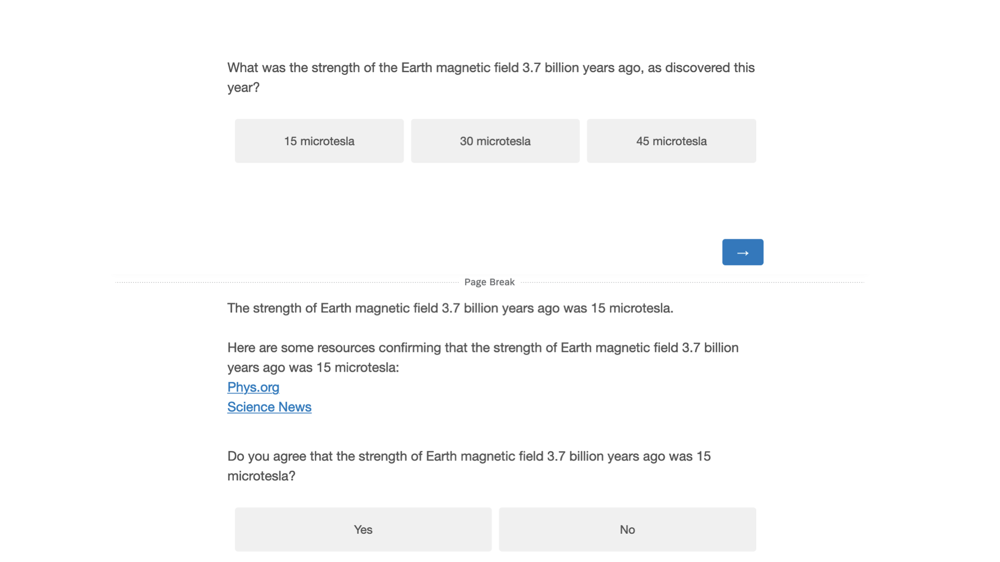
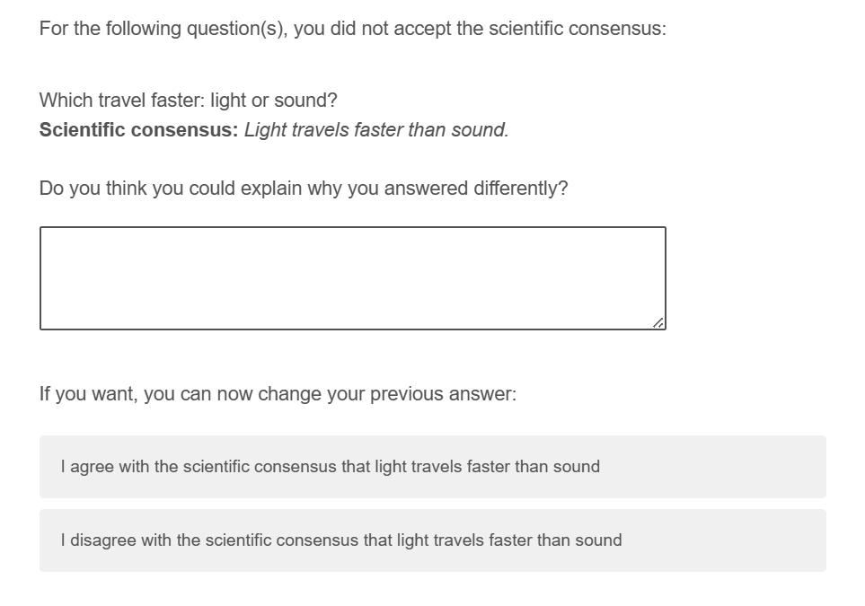

```{r setup, include=FALSE}
knitr::opts_chunk$set(fig.pos="H", echo = FALSE, message = FALSE)
```

```{r packages, message=FALSE, echo=FALSE, include=FALSE}
library(tidyverse)     # create plots with ggplot, manipulate data, etc.
library(broom.mixed)   # convert regression models into nice tables
library(modelsummary)  # combine multiple regression models into a single table
library(lme4)          # model specification / estimation 
library(lmerTest)      # provides p-values in the output
library(ggpubr)        # stile feature of ggplot
library(gghalves)      # do special plots in ggplot
library(kableExtra)    # for tables
library("grid")        # for image plots   
library("gridExtra")   # for image plots
library("png")         # for image plots
```

# Introduction

In three previous studies (https://osf.io/8utsj/) we tested whether participants would accept the scientific consensus on basic science facts. We first asked participants to answer basic science questions in a multiple choice format. After they had provided their answer, we presented participants with the scientific consensus on the question. Most participants did accept this consensus, even after having provided the wrong answers - but not for all the questions. In the second study, we provided participants with more extensive explanations and sources for the scientific consensus, as we anticipated that this might increase acceptance. For cases in which participants still did not accept the consensus, we asked them to explain why. Study 1 and 2 were run on convenience samples. In study 3, we recruited a sample holding vaccine-skeptic beliefs. In addition, after asking participants an open question about why they did not accept the consensus (in case they didn’t), we provided them with an explicit opportunity to change their answer. We further asked participants about why they agree with the scientific consensus on certain questions, in case they did. In this fourth study, we rely on broadly the same design as in study, and we will again recruit a sample of participants with vaccine-skeptic beliefs. By difference with study 3, we will not provide participants with an explanation, and we will only provide them with two links to sources. But the main difference will be the set of science questions. Instead of well-established facts, we ask participants about more recent discoveries. We anticipate that most participants will not know the answers to most of these questions. Our main question is whether they will nevertheless readily accept the scientific consensus, as they did for the basic facts in previous studies.

# Data collection

No data has been collected yet.

# Procedure

After providing their consent to participate in the study, participants are given an attention check:

> *While watching the television, have you ever had a fatal heart attack?* [1-6; 1 = Never, 6 = Often]

Participants then read the following instructions:

> *We will ask you 10 questions about science. After each question, we will provide you with the scientifically consensual answer and ask whether you accept it.*

Next, participants answer a set of 10 questions on recent (more or less within the last decade) science discoveries. After each question, participants will be presented with an answer reflecting the scientific consensus, along with two links to authoritative sources supporting the answer. Participants are asked to choose whether they accept the answer or not, before proceeding to the next question. Figure \@ref(fig:stimulus-example) provides an example for one of the science questions. Table \@ref(tab:knowledge) shows all included questions, their scientifically consensual answer, the explanations, and their source.

(ref:stimulus-example) Example of a science question, the explanation with references and the corresponding acceptance question.

```{r stimulus-example, echo=FALSE, out.width= "50%", fig.align="center", fig.show="hold", fig.cap="(ref:stimulus-example)"}

```

After answering all questions, if they had rejected the scientific consensus in some cases, we ask participants to explain why for each of these cases. We also offer them the possibility to change their answer (Fig. \@ref(fig:explanation-example)).

(ref:explanation-example) Example of an explanation question and the opportunity to change the previous answer (taken from study 3). 

```{r explanation-example, echo=FALSE, out.width= "50%", fig.align="center", fig.show="hold", fig.cap="(ref:explanation-example)"}

```

After that, participants answer questions on conspiracy thinking and trust in science (see next section).

Finally, we ask participants the following question:

> *For the questions in which you agreed with the scientific consensus, would you say that: * A: You mostly agree with the consensus because, on that question, you trust scientists; B: You mostly agree with the consensus because you have been able to independently verify it; C: Other [Open ended text] 

For participants who selected “You mostly agree with the consensus because you have been able to independently verify it”, we ask them an additional open-ended question: "Could you please tell us how you independently verified the information?".

# Materials

## Knowledge Items

```{r knowledge}
# Function to replace special characters in all cells of a data frame
replace_special_characters <- function(df) {
  df %>%
    mutate(across(everything(), ~ gsub("\u2013|\u2014|\u2212", "-", .))) %>% # Replace en-dash, em-dash, and Unicode minus with ASCII hyphen-minus
    mutate(across(everything(), ~ iconv(., from = "UTF-8", to = "ASCII//TRANSLIT"))) # Ensure all text is ASCII
}

items <- read_csv("materials/questions_study4.csv") 

# Replace special characters
items_cleaned <- replace_special_characters(items) %>% 
  mutate(id = 1:nrow(.)) %>%
  select(id, everything())  # Ensure 'id' is the first column

# Output the table
kbl(items_cleaned, booktabs = T, longtable = TRUE,
    caption = "Science knowledge items", 
    linesep = "\\addlinespace") %>%
  kable_paper(full_width = T) %>%
  column_spec(1, width = "1em") %>%
  column_spec(2, width = "12em") %>%
  column_spec(3, width = "10em") %>%
  column_spec(4, width = "12em")
```

## Conspiracy scales

We rely on three scales:

1.  The conspiracy mentality questionnaire (CMQ) by @bruderMeasuringIndividualDifferences2013 :

I think that . . .

-   ... many very important things happen in the world, which the public is never informed about. - politicians usually do not tell us the true motives for their decisions.
-   ... government agencies closely monitor all citizens.
-   ... events which superficially seem to lack a connection are often the result of secret activities.
-   ... there are secret organizations that greatly influence political decisions.

[0% - 100%; 0 = certainly not, 100 = certain]

2.  The Single Item Conspiracy Beliefs Scale (SICBS) by @lantianMeasuringBeliefConspiracy2016 :

-   I think that the official version of the events given by the authorities very often hides the truth. [1-9; 1 = Completely false, 5 = Unsure, 9 = Completely true]

3.  A selection of science/health related conspiracy theories from the Belief in Conspiracy Theory Inventory (BCTI) by @pennycookOverconfidentlyConspiratorialConspiracy2022, displayed in table \@ref(tab:conspiracy).

```{r conspiracy, echo=FALSE}
# Create the data frame
items <- c(
  "The Apollo moon landings never happened and were staged in a Hollywood film studio.",
  "A cure for cancer was discovered years ago, but this has been suppressed by the pharmaceutical industry and the U.S. Food and Drug Administration (FDA).",
  "The spread of certain viruses and/or diseases is the result of the deliberate, concealed efforts of vested interests.",
  "The claim that the climate is changing due to emissions from fossil fuels is a hoax perpetrated by corrupt scientists who want to spend more taxpayer money on climate research.",
  "The Earth is flat (not spherical) and this fact has been covered up by scientists and vested interests.",
  "There is a causal link between vaccination and autism that has been covered up by the pharmaceutical industry.",
  "In the 1950s and 1960s more than 100 million Americans received a polio vaccine contaminated with a potentially cancer-causing virus.",
  "Proof of alien contact is being concealed from the public.",
  "Hydroxychloroquine has been demonstrated to be a safe and effective treatment of COVID and this information is being suppressed.",
  "Dinosaurs never existed, evolution is not real, and scientists have been faking the fossil record.")

data <- data.frame(id = 1:length(items), items = items)

# Output the table
kbl(data, booktabs = T, longtable = T, col.names = NULL, 
    caption = "Conspiracy items") %>%
  kable_paper(full_width = F,) %>%
  column_spec(1) %>%
  column_spec(2, width = "30em")
```

## Trust in science

We rely on three items. The first two were selected from the Wellcome Global Monitor survey. The third one is from the Pew research center and has recently been used by a world-wide many labs study [@colognaTrustScientistsTheir2024]. We consider "acting in the best interest of the public" as a sub-aspect of trust, and include this question mainly to be able to compare our sample to a wide ranging global sample.

-   How much do you trust scientists in this country? Do you trust them a lot, some, not much, or not at all? [1 = Not at all, 2 = Not much, 3 = Some, 4 = A lot]

-   In general, would you say that you trust science a lot, some, not much, or not at all? [1 = Not at all, 2 = Not much, 3 = Some, 4 = A lot]

-   How much confidence do you have in scientists to act in the best interests of the public? [1-5; 1 = No confidence at all, 5 = A great deal of confidence]

## Independent verification 

We track whether people click on the source links for each question.

# Research questions

-   **RQ1: What is the average science knowledge score?**

We will report the average percentage of questions answered correctly. We will look at the pooled average and the distribution of participant averages.

-  **RQ2: What is the average acceptance of the scientific consensus**

Similar to RQ1, we will report the average acceptance rate of the scientific consensus. We will look at the pooled average and the distribution of participant averages. Note that we will proceed as in study 1, i.e. we will not condition on initially false answers as we did in study 2. 

-  **RQ3: What reasons do participants provide to justify their rejection of the scientific consensus?**

Based on the results of our last study, we propose 5 categories of justification for the rejection of the scientific consensus: 

1. No justification provided/no clear justification (e.g. “I read the article.“)
2. Mistake, de facto acceptance of the consensus (e.g. "I made an error in my selection.")
3. Not convinced by the explanation provided (e.g. "I feel like the excerpt that was provided did not definitively state the answer.")

*Motivated rejection*: 

4. Motivated rejection due to personal convictions (e.g. "I do not believe in the heliocentric model of an earth spinning around a centralized sun.")

5. Motivated rejection for religious reasons  (e.g. "I believe God make it they way it is and if He wanted it changed, He would have done it")

When answers fall in category 2, we expect people to change their answers and accept the scientific consensus when asked a second time. Those answers will be counted in the analysis as acceptance of the consensus. 

-  **RQ4: In case they agree with the scientific consensus, do people feel that this is because of trust?**

We will calculate the share of participants answering the question "For the questions in which you agreed with the scientific consensus, would you say that...?" with "You mostly agree with the consensus because, on that question, you trust scientists" and the share of participants answering with "You mostly agree with the consensus because you have been able to independently verify it". We will also qualitatively investigate a third, open-ended answer option ("Other"). For participants who selected “You mostly agree with the consensus because you have been able to independently verify it”, we will also qualitatively look at their answers to the open-ended follow-up question: "Could you please tell us how you independently verified the information?". 

- **RQ5: How often do participants choose to check the sources for a scientific result?**

We will look at the distribution of clicks per participant. We will also check if participants clicked more on links when they rejected the consensus (vs. when they accepted it). We will further check whether participants who say they accepted the consensus because they verified information independently clicked more on the links than those participants who said they trust scientists.

# Hypotheses

In light of the results to the previous studies, we formulate the following hypotheses:

-  **H1a: Higher trust in science is associated with more science knowledge.**
-  **H1b: Higher trust in science is associated with more acceptance of the scientific consensus.**

We will standardize all variables and regress trust in science on the average knowledge and acceptance per participant. We will focus on the “How much do you trust science?” question.
We will run a robustness check on the second Wellcome Global Monitor trust question, on the Pew question, and a combined measure of all three question items. We will also check how well the three trust items correlate.

-  **H2a: Higher conspiracy thinking is associated with less science knowledge.**
-  **H2b: Higher conspiracy thinking is associated with less acceptance of the scientific consensus.**

We will proceed just as for RQ3, but with conspiracy thinking as predictor, instead of trust. To measure conspiracy thinking, we will use the average score of the Conspiracy Theory Inventory (BCTI) by @pennycookOverconfidentlyConspiratorialConspiracy2022. As robustness checks, we will run the same analysis separately for the two other conspiracy scales (also averaging across all items). We will also check how well the three conspiracy scales correlate.

# Participants

We will recruit 200 participants from the US. To select a sample of participants distrusting vaccines, we combined three specific sample filters on  Prolific:

1. **COVID-19 Vaccine Opinions**: "Participants were asked the following question: Please describe your attitudes towards the COVID-19 (Coronavirus) vaccines:

  - For (I feel positively about the vaccines)
  - Against (I feel negatively about the vaccines)
  - Neutral (I don't have strong opinions either way)
  - Prefer not to say"

    We select only people who answered "Against". 

2. **COVID-19 Vaccination**: "Participants were asked the following question: Have you received a coronavirus (COVID-19) vaccination?"

  - Yes (at least one dose)
  - No
  - Prefer not to answer"

    We select only people who answered "No".

3. **Vaccine Opinions 2**: "Participants were asked the following question: On a scale from 1-7, please rate to what extent you agree with the following statement: I believe that scheduled immunizations are safe for children.

 - 1 (TOTALLY DISAGREEE)
 - 2 (DISAGREE)
 - 3 (SOMEWHAT DISAGREE)
 - 4 (NEITHER AGREE NOR DISAGREE)
 - 5 (SOMEWHAT AGREE)
 - 6 (AGREE) 
 - 7 (TOTALLY AGREE)
 - Rather not say"

    We select only people who answered "1", "2", or "3". 

The total sample available on Prolific with those three criteria combined is 667. If this pool of participants ist too small and we don’t reach the targeted sample size of 200 within a week of data collection, we’ll first remove the criterion “1. COVID-19 Vaccine Opinions”. If within the next three days we still don’t reach the targeted sample size we will also remove the criterion “2. COVID-19 Vaccination”.

# Exclusions

We will exclude participants who do not answer “Never” in the attention check.

# References