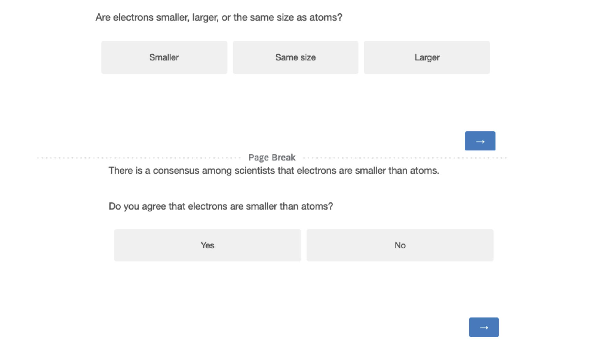

```{r setup, include=FALSE}
# Figure out output format
is_docx <- knitr::pandoc_to("docx") | knitr::pandoc_to("odt")
is_latex <- knitr::pandoc_to("latex")
is_html <- knitr::pandoc_to("html")

# Word-specific things
table_format <- ifelse(is_docx, "huxtable", "kableExtra")  # Huxtable tables
conditional_dpi <- ifelse(is_docx, 300, 300)  # Higher DPI
conditional_align <- ifelse(is_docx, "default", "center")  # Word doesn't support align

# Knitr options
knitr::opts_chunk$set(
  echo = FALSE, warning = FALSE, message = FALSE,
  # tidy.opts = list(width.cutoff = 120),  # Code width
  # fig.retina = 3, dpi = conditional_dpi,
  # fig.width = 7, fig.asp = 0.618,
  # fig.align = conditional_align, out.width = "100%",
  fig.path = "output/figures/",
  cache.path = "output/_cache/",
  fig.process = function(x) {  # Remove "-1" from figure names
    x2 = sub('-\\d+([.][a-z]+)$', '\\1', x)
    if (file.rename(x, x2)) x2 else x
  },
  options(scipen = 99999999)  # Prevent scientific notation
)

# R options
options(
  width = 90,  # Output width
  dplyr.summarise.inform = FALSE,  # Turn off dplyr's summarize() auto messages
  knitr.kable.NA = "",  # Make NAs blank in kables
  kableExtra.latex.load_packages = FALSE,  # Don't add LaTeX preamble stuff
  modelsummary_factory_default = table_format,  # Set modelsummary backend
  modelsummary_format_numeric_latex = "plain"  # Don't use siunitx
)
```

```{r packages, include=FALSE}
# load required packages
library("papaja")      # For APA style manuscript   
library("lme4")        # model specification / estimation
library("lmerTest")    # provides p-values in the output
library("tidyverse")   # data wrangling and visualisation
library("afex")        # anova and deriving p-values from lmer
library("broom")       # extracting data from model fits 
library("broom.mixed") # extracting data from mixed models
library("metafor")     # doing mata analysis
library("patchwork")   # put several plots together
library("ggridges")    # for plots
library("gghalves")    # for plots
library("ggbeeswarm")  # Special distribution-shaped point jittering
library("knitr")       # for tables
library("kableExtra")  # also for tables
library("ggpubr")      # for combining plots with ggarrange() 
library("grid")        # for image plots   
library("gridExtra")   # for image plots
library("png")         # for image plots
library("modelsummary") # for regression tables
```

```{r functions}
# load plot theme
source("functions/plot_theme.R") 

# load other functions
source("functions/own_functions.R")
```

# Introduction

There is increasingly more talk of defiance towards science and towards experts more generally (for science, see the intro to the stability paper, see also Paresman et al on populism?). In every population, many people only trust science ‘some of the time’, and a sizable minority doesn’t trust it.

This appears difficult to reconcile with the fact that, in many countries, most people receive at least a basic science education, that science education (along with education more generally) is increasing, and that science education seems to be the main driver of trust in science. 

But how deep is distrust of science? Do people reject science wholesale, or is it more driven by attitudes towards specific contents, maybe in particular those seen as being politicized, or as going against deeply held beliefs, or behaviors they want to engage in? [previous work suggests that issue-specific claims provoke more negative attitudes]

Here, we look at whether people, across different levels of trust in science (and of other relevant attitudes? Conspi? Populists? Apparently on Prolific we can specifically target antivax people for instance, which could be quite useful), accept basic scientific facts. 

[We can draw some inspiration from the “Westwood et al 2021 Current research overstates American support for political violence” paper: we want to put in perspective the current rise (? discourse around?) in mistrust towards science]

## Levels of trust in science


## Why do people distrust science?

[here? We know from the many studies on the gateway belief model that people don’t always accept the scientific consensus (indeed, the effect sizes are usually not massive)]

## How much science do people know?

This is a crucial point: if there are questions with specific scientific answers that just about everyone already knows, then in a sense our point is already proven… so the first thing to do would be to look at data on knowledge of science, and see what the highest rates of correct answer is, to see how much room for improvement there is.

“The dominant approach to conceptualizing and measuring science literacy in population surveys has arisen out of work by Jon D. Miller and Kenneth Prewitt in the United States (see Miller, 1983, 1998, 2004) alongside collabora- tors in Great Britain (see Durant et al., 1989). Underlying these efforts appears to have been widespread concern among policy makers and the scientific com- munity that nonscientists were becoming skeptical about the benefits of sci- ence and that such skepticism might result in cuts to science funding that would harm the scientific progress that many argue underpins both American and European economic development (Bauer et al., 2007). The results of the U.S. portion of this work have formed the core of a chapter of a biennial report called Science and Engineering Indicators (hereafter, Indicators) that the National Science Board provides to Congress and the Executive Branch. Scholars have also used the raw data collected for Indicators (which is made publicly available) for peer-reviewed research (e.g., Gauchat, 2012; Losh, 2010), and other countries have used many of the Indicators’ questions for their own national surveys (e.g., Bauer et al., 2012a; National Science Board, 2016).”

# First series of experiments

The goal is to see how many people really don’t accept basic science (in practice, get as close to ceiling in acceptance as we can, first with a generic sample, then see if that still works with an anti-vax sample).

# Experiment 1

```{r exp1}
# Analyze data of experiments and store results

# Experiment 1

# read the cleaned long version data set
exp1_long <- read_csv("exp_1/data/cleaned_long.csv")

# read wide version data set
exp1_wide <- read_csv("exp_1/data/cleaned_wide.csv") 

# Research questions

# RQ3
cor_trust_knowledge <- cor(exp1_wide$wgm_sciencegeneral, exp1_wide$avg_knowledge) %>% round(digits = 2)

cor_trust_acceptance <- cor(exp1_wide$wgm_sciencegeneral, exp1_wide$avg_acceptance) %>% round(digits = 2)

# RQ4
cor_conspiracy_knowledge <- cor(exp1_wide$BCTI_avg, exp1_wide$avg_knowledge) %>% round(digits = 2)

cor_conspiracy_acceptance <- cor(exp1_wide$BCTI_avg, exp1_wide$avg_acceptance) %>% round(digits = 2)

# Exploratory: Acceptance and trust in science/conspiracy thinking conditional on false answers only
exp1_false_knowledge <- exp1_long %>% 
  # make numeric versions
  mutate(acceptance_num = ifelse(acceptance == "Yes", 1, 0)
  ) %>% 
  group_by(id, knowledge) %>% 
  # calculate by-participant averages
  summarize(
    n = n(),
    n_accepted = sum(acceptance_num),
    avg_acceptance  = sum(acceptance_num)/n(), 
    wgm_sciencegeneral = mean(wgm_sciencegeneral), 
    BCTI_avg = mean(BCTI_avg), 
    # add additonal measures for robustness checks
    CMQ_avg = mean(CMQ_avg), 
    SICBS = mean(SICBS),
    wgm_scientists = mean(wgm_scientists), 
    pew = mean(pew)
  ) %>% 
  # filter to only false responses
  filter(knowledge == FALSE) %>% 
  ungroup()

false_answers_cor_trust_acceptance <- cor(exp1_false_knowledge$wgm_sciencegeneral, exp1_false_knowledge$avg_acceptance) %>% round(digits = 2)

false_answers_cor_conspiracy_acceptance <- cor(exp1_false_knowledge$BCTI_avg, exp1_false_knowledge$avg_acceptance) %>% round(digits = 2)


# extract descriptives for inline reporting
exp1_descriptives <- list(
  # Demographics
  n_subj = n_distinct(exp1_wide$id),
  gender = exp1_wide %>% group_by(gender) %>% summarize(n = n_distinct(id)) %>% split(.$gender),
  age = exp1_wide %>% summarize(across(age,list(mean = mean, median = median, sd = sd), 
                                       .names = "{.fn}")) %>% rounded_numbers(),
  # RQ1 & RQ2
  means = exp1_wide %>% 
    summarize(across(c(avg_knowledge, avg_acceptance), 
                     list(mean = mean, sd = sd), 
                     .names = "{.col}_{.fn}")) %>%
    rename_with(~sub("^avg_", "", .), everything()) %>% 
    mutate_if(is.numeric, round, digits = 2) %>% 
  mutate(across(ends_with("_mean"), ~paste0(.*100, " %"))) ,
  # RQ3
  cor_trust_knowledge = cor_trust_knowledge,
  cor_trust_acceptance = cor_trust_acceptance,
  # RQ4
  cor_conspiracy_knowledge = cor_conspiracy_knowledge,
  cor_conspiracy_acceptance = cor_conspiracy_acceptance, 
  # Exploratory
  # acceptance and knowledge
  conditional_acceptance = exp1_long %>% 
    group_by(knowledge, acceptance) %>% 
    count() %>% 
    group_by(knowledge) %>% 
    mutate (share = n/sum(n), 
            # rename knowledge values
            knowledge = ifelse(knowledge == FALSE, "false", "true")) %>% 
    mutate_if(is.numeric, round, digits = 3) %>% 
    mutate (share = paste0(share*100, " %")) %>% 
    super_split(knowledge, acceptance),
  # acceptance and trust in science/conspiracy thinking
  false_answers_cor_trust_acceptance = false_answers_cor_trust_acceptance,
  false_answers_cor_conspiracy_acceptance = false_answers_cor_conspiracy_acceptance
)
```

The main goal of experiment one was to test whether people would accept the scientific consensus on basic knowledge questions. Additionally, we wanted to know if both science knowledge and acceptance of the scientific consensus are associated with trust in science and conspiracy thinking. We had the following research questions:

**RQ1: What is the average science knowledge score (1)?**

**RQ2: What is the average acceptance of the scientific consensus (2)?**

**RQ3: What is the relationship between trust in science and, respectively, (1) and (2)?**

**RQ4: What is the relationship between conspiracy thinking and, respectively, (1) and (2)?**

## Methods

### Participants

We recruited 200 participants from the US via prolific. 6 participants failed our attention check, resulting in a final sample of `r exp1_descriptives$n_subj` participants (`r exp1_descriptives$gender$female$n` female, `r exp1_descriptives$gender$male$n` male; $age_\text{mean}$: `r exp1_descriptives$age$mean`, $age_\text{sd}$: `r exp1_descriptives$age$sd`, $age_\text{median}$: `r exp1_descriptives$age$median`). Since we did not have any prior assumptions on effect sizes, we did not do a power analysis. 

### Procedure

After providing their consent to participate in the study, participants were given an attention check "While watching the television, have you ever had a fatal heart attack?" [1-6; 1 = Never, 6 = Often]. All participants who did not answer "1 = Never" were excluded. Participants then read the following instructions:"We will ask you 11 questions about science. After each question, we will provide you with the scientifically consensual answer and ask whether you accept it." Next, participants answered a set of 10 basic science questions, which were randomly selected from a pool of 11 questions, in random order. After each question, participants were presented with an answer reflecting the scientific consensus. Participants were asked to choose whether they accept the answer or not, before proceeding to the next question. Figure \@ref(fig:stimulus-example) displays the survey for an example science question. Finally, participants answered questions on conspiracy thinking and trust in science.

(ref:stimulus-example) Example of a science question, the scientific consensus and the corresponding acceptance question.

```{r stimulus-example, echo=FALSE, out.width= "100%", fig.align="left", fig.show="hold", fig.cap="(ref:stimulus-example)"}

```

### Materials

#### Science knowledge and acceptance

Table \@ref(tab:knowledge) shows all questions, their scientifically consensual answer, and their source. All but two questions were selected from existing science knowledge questionnaires. We tried to select non-political questions. 

```{r knowledge}
items <- read_csv("exp_1/materials/knowledge_items.csv") %>% 
  mutate(id = 1:nrow(.)) %>% 
  select(id, Question, `Scientific consensus`, `Reference(s)`)

# Output the table
kbl(items, booktabs = T, longtable = TRUE,
    caption = "Science knowledge items", 
    full_width = T) %>%
  column_spec(1, width = "1em") %>%
  column_spec(2, width = "10em") %>%
  column_spec(3, width = "10em") %>%
  column_spec(4, width = "15em") 
```


#### Conspiracy scales

To measure conspiracy thinking, we selected 10 science/health related conspiracy theories from the Belief in Conspiracy Theory Inventory (BCTI) by @pennycookOverconfidentlyConspiratorialConspiracy2022 (Table \@ref(tab:conspiracy)).

```{r conspiracy, echo=FALSE}
# Create the data frame
items <- c(
  "The Apollo moon landings never happened and were staged in a Hollywood film studio.",
  "A cure for cancer was discovered years ago, but this has been suppressed by the pharmaceutical industry and the U.S. Food and Drug Administration (FDA).",
  "The spread of certain viruses and/or diseases is the result of the deliberate, concealed efforts of vested interests.",
  "The claim that the climate is changing due to emissions from fossil fuels is a hoax perpetrated by corrupt scientists who want to spend more taxpayer money on climate research.",
  "The Earth is flat (not spherical) and this fact has been covered up by scientists and vested interests.",
  "There is a causal link between vaccination and autism that has been covered up by the pharmaceutical industry.",
  "In the 1950s and 1960s more than 100 million Americans received a polio vaccine contaminated with a potentially cancer-causing virus.",
  "Proof of alien contact is being concealed from the public.",
  "Hydroxychloroquine has been demonstrated to be a safe and effective treatment of COVID and this information is being suppressed.",
  "Dinosaurs never existed, evolution is not real, and scientists have been faking the fossil record.")

data <- data.frame(id = 1:length(items), items = items)

# Output the table
kbl(data, booktabs = T, longtable = T, col.names = NULL, 
    caption = "Conspiracy items", 
    full_width = F) %>%
  column_spec(1) %>%
  column_spec(2, width = "30em")
```

To cross-check our results with alternative measures, we also assessed the conspiracy mentality questionnaire (CMQ) by @bruderMeasuringIndividualDifferences2013 and the Single Item Conspiracy Beliefs Scale (SICBS) by @lantianMeasuringBeliefConspiracy2016 (see Appendix \@ref(exp1)). 

#### Trust in science

Our main item for measuring trust in science is selected from the Wellcome Global Monitor survey: "In general, would you say that you trust science a lot, some, not much, or not at all? [1 = Not at all, 2 = Not much, 3 = Some, 4 = A lot]"

We also included two additional trust questions, one also from the Wellcome Global Monitor (WGM) survey ("How much do you trust scientists in this country? Do you trust them a lot, some, not much, or not at all? [1 = Not at all, 2 = Not much, 3 = Some, 4 = A lot]"), the other from the Pew research center ("How much confidence do you have in scientists to act in the best interests of the public? [1-5; 1 = No confidence at all, 5 = A great deal of confidence]"). We selected these items so that we could compare the ratings in our sample to global survey results. The WGM survey has been administered in over 140 countries and included over 140000 respondents. The Pew question has recently been used by a world-wide many labs study in 67 countries with 71417 respondents [@colognaTrustScientistsTheir2024]. 

## Results 

Regarding RQ1 and RQ2, participants answered on average `r exp1_descriptives$means$knowledge_mean` (sd = `r exp1_descriptives$means$knowledge_sd`) of the questions correctly, and accepted the scientific consensus on average for `r exp1_descriptives$means$acceptance_mean` (sd = `r exp1_descriptives$means$acceptance_sd`) of the questions.

Fig. \@ref(fig:exp1-conditional-acceptance) illustrates the relationship between knowledge and acceptance. In most cases (`r exp1_descriptives$conditional_acceptance$false$Yes$share`), participants readily accepted the scientific consensus after having given the wrong answer to a question. In very few cases (`r exp1_descriptives$conditional_acceptance$true$No$share`), participants who gave the correct response afterwards rejected the scientific consensus, thereby contradicting their own initial response. We believe this might have been due to inattention.

(ref:exp1-conditional-acceptance) Acceptance rates of scientific consensus, based on whether the initial response to the knowledge question was false or true.

```{r exp1-conditional-acceptance, fig.cap="(ref:exp1-conditional-acceptance)"}
plot_data <- exp1_long %>% 
  group_by(knowledge, acceptance) %>% 
  count() %>% 
  group_by(knowledge) %>% 
  mutate (share = n/sum(n)) %>% 
  mutate_if(is.numeric, round, digits = 3)

absolute_numbers <- plot_data %>% 
  group_by(knowledge) %>% 
  summarise(n = sum(n))


ggplot(plot_data, aes(x = knowledge, y = share, fill = acceptance)) +
  geom_col(position = "dodge") +
  scale_y_continuous(labels = scales::percent_format(), breaks = seq(0, 1, 0.1)) +
  geom_text(aes(label = paste0(round(share * 100, 1), "%")),
            position = position_dodge(width = 0.9),
            vjust = -0.5, size = 3) +
  scale_fill_viridis_d(option = "cividis") +
  labs(x = "Knowledge answer", fill = "Acceptance \nof consensus") +
  theme_minimal() +
  geom_bracket(data = absolute_numbers,
               aes(xmin = as.numeric(factor(knowledge)) - 0.4, 
                   xmax = as.numeric(factor(knowledge)) + 0.4, 
                   y.position = 1.05, label =  paste0("n = ", n)),
               inherit.aes = FALSE,
               step.increase = 0)
```


For RQ3, we find a positive but small correlation between both science knowledge and trust in science (r = `r exp1_descriptives$cor_trust_knowledge`), and acceptance of scientific consensus and trust in science ( r = `r exp1_descriptives$cor_trust_acceptance`). The more people are knowledgeable about science and the more they tend to accept the scientific consensus, the more they tend to trust science. These correlations are relatively weak, which might be partly due to ceiling effects: As illustrated in Fig. \@ref(fig:exp1-plot), (i) most people do trust science, and (ii) that is true even among people with low knowledge or acceptance rates. 

For RQ4, we find a negative correlation of similar magnitude between conspiracy thinking and science knowledge (r = `r exp1_descriptives$cor_conspiracy_knowledge`), and conspiracy thinking and acceptance of scientific consensus ( r = `r exp1_descriptives$cor_conspiracy_acceptance`).

In Appendix \@ref(exp1) we show that these results hold for our alternative measures of trust and conspiracy thinking. We also include more descriptive statistics, such as knowledge and acceptance by science questions.

Are trust in science and conspiracy thinking, respectively, associated with being more easily convinced of the scientific consensus? In our main analyses, we looked at correlations of acceptance across all observations. One possibility is that the associations between trust in science/conspiracy thinking and acceptance of scientific consensus are explained by science knowledge: People who give the right answer in the first place are more ready to accept the consensus, and trust in science/conspiracy thinking are mostly associated with this knowledge, but not with willingness to accept the consensus. To addressed this potential confound, in a non-preregistered analysis, we restricted our sample to cases where participants gave the wrong answer to the knowledge question. We than calculated the correlation between trust in science and average acceptance rate by participant. We find a slightly smaller negative correlation of acceptance with for conspiracy thinking (r = `r exp1_descriptives$false_answers_cor_conspiracy_acceptance`), and only a very small correlation for trust in science (r = `r exp1_descriptives$false_answers_cor_trust_acceptance`). These associations are not statistically significant (see Appendix \@ref(exp1)).

(ref:exp1-plot) **A** Shows the distribution of science knowledge (left) and acceptance of scientific consensus  **B** Shows the relationship between trust in science and science knowledge/acceptance of scientific consensus **C** Shows the relationship between conspiracy thinking and science knowledge/acceptance of scientific consensus

```{r exp1-plot, fig.cap="(ref:exp1-plot)", fig.height= 10, fig.width=10}
# Plot distributions of knowledge and acceptance and their mean

mean_value_knowledge <- mean(exp1_wide$avg_knowledge)
max_n <- max(table(exp1_wide$avg_acceptance))

knowledge_mean <- ggplot(exp1_wide, aes(x = avg_knowledge)) +
  geom_bar() + 
  geom_vline(xintercept = mean_value_knowledge, color = "red", linetype = "dashed") +
  geom_text(aes(x = mean_value_knowledge, y = 40, label = paste("Mean =", round(mean_value_knowledge, 2))), 
            vjust = -0.5, hjust = 1.2, check_overlap = TRUE) +
  scale_x_continuous(breaks = seq(0, 1, 0.1)) +
  scale_y_continuous(breaks = seq(0, max_n, 10)) +
  coord_cartesian(xlim = c(0, 1), 
                  ylim = c(0, max_n)) +
  labs(x = "Average science knowledge", 
       y = "N")

mean_value <- mean(exp1_wide$avg_acceptance)

acceptance_mean <- ggplot(exp1_wide, aes(x = avg_acceptance)) +
  geom_bar() + 
  geom_vline(xintercept = mean_value, color = "red", linetype = "dashed") +
  geom_text(aes(x = mean_value, y = 60, label = paste("Mean =", round(mean_value, 2))), 
            vjust = -0.5, hjust = 1.2, check_overlap = TRUE) +
  scale_x_continuous(breaks = seq(0, 1, 0.1)) +
  scale_y_continuous(breaks = seq(0, max_n, 10)) +
  coord_cartesian(xlim = c(0, 1), 
                  ylim = c(0, max_n)) +
  labs(x = "Average consensus acceptance", 
       y = "N")

# Trust in science plots
plot_data <- exp1_wide %>% 
  group_by(wgm_sciencegeneral, avg_knowledge) %>% 
  summarise(n = n())

trust_knowledge <- ggplot(plot_data, aes(x = avg_knowledge, y = wgm_sciencegeneral, fill = n)) +
  geom_tile() +  # Add black border around tiles for better visibility
  geom_jitter(inherit.aes = FALSE, data = exp1_wide, aes(x = avg_knowledge, y = wgm_sciencegeneral),
              width = 0.03, height = 0.08) +  # Scatter points within each tile
  scale_fill_viridis_c(option = "plasma") +  # Use Viridis color scale (Plasma)
  scale_x_continuous(breaks = seq(0, 1, 0.1)) +
  coord_cartesian(xlim = c(0, 1)) +
  scale_y_continuous(breaks = 1:5) +
  labs(x = "Average science knowledge", 
       y = "Trust in science", 
       fill = "N")

plot_data <- exp1_wide %>% 
  group_by(wgm_sciencegeneral, avg_acceptance) %>% 
  summarise(n = n())


trust_acceptance <- ggplot(plot_data, aes(x = avg_acceptance, y = wgm_sciencegeneral, fill = n)) +
  geom_tile() +  
  geom_jitter(inherit.aes = FALSE, data = exp1_wide, aes(x = avg_acceptance, y = wgm_sciencegeneral),
              width = 0.03, height = 0.08) + 
  scale_fill_viridis_c(option = "plasma") + 
  scale_x_continuous(breaks = seq(0, 1, 0.1)) +
  coord_cartesian(xlim = c(0, 1)) +
  scale_y_continuous(breaks = 1:5) +
  labs(x = "Average consensus Acceptance", 
       y = "Trust in science", 
       fill = "N") +
  theme(legend.position = "top")

# Conspiracy Thinking plots

conspiracy_knowledge <- ggplot(exp1_wide, aes(x = avg_knowledge, y = BCTI_avg)) +
  geom_point() +
  geom_smooth(method = "lm") +
  scale_x_continuous(breaks = seq(0, 1, 0.1)) +
  scale_y_continuous(breaks = 1:9) +
  coord_cartesian(xlim = c(0, 1), 
                  ylim = c(0, 9)) +
  labs(x = "Average science knowledge", 
       y = "Average conspiracy thinking")

conspiracy_acceptance <- ggplot(exp1_wide, aes(x = avg_acceptance, y = BCTI_avg)) +
  geom_point() +
  geom_smooth(method = "lm") +
  scale_x_continuous(breaks = seq(0, 1, 0.1)) +
  scale_y_continuous(breaks = 1:9) +
  coord_cartesian(xlim = c(0, 1), 
                  ylim = c(0, 9)) +
  labs(x = "Average consensus acceptance", 
       y = "Average conspiracy thinking") +
  theme(legend.position = "top")

# Combine plots

# distributions
distributions <- ggarrange(knowledge_mean + 
                             rremove("xlab") , 
                           acceptance_mean + 
                             rremove("xlab") +
                             rremove("ylab")) 

# trust
trust <- ggarrange(trust_knowledge + 
                             rremove("xlab") +
                             guides(fill = "none") +
                             labs(caption = NULL) , 
                           trust_acceptance + 
                             rremove("xlab") +
                             rremove("ylab"), 
                   common.legend = TRUE) 

# conspiracy
conspiracy <- ggarrange(conspiracy_knowledge, 
                           conspiracy_acceptance + 
                             rremove("ylab"), 
                   common.legend = TRUE) 


# common plot
patchwork <- (distributions / trust / conspiracy) + 
  plot_annotation(tag_levels = 'A')  

patchwork

```

## Discussion

These results suggest that even when people do not know the answer to science questions, they tend to mostly accept the scientific consensus. Yet, in `r exp1_descriptives$conditional_acceptance$false$No$share` of the cases, participants rejected the scientific consensus after having given the wrong answer, suggesting that simply stating the consensus is not sufficient to convince participants sometimes. In general, people with lower trust in science and who believe more in conspiracy theories tend to both know less about science and accept the scientific consensus less. However, conditioning our analyses to initial false knowledge responses, i.e. looking at change of opinion towards the scientific consensus, we find that trust in science is onl

\FloatBarrier

# References

::: {#refs}
:::

\newpage

# (APPENDIX) Appendix {-}

```{r child = "appendix_exp1.Rmd"}
```

