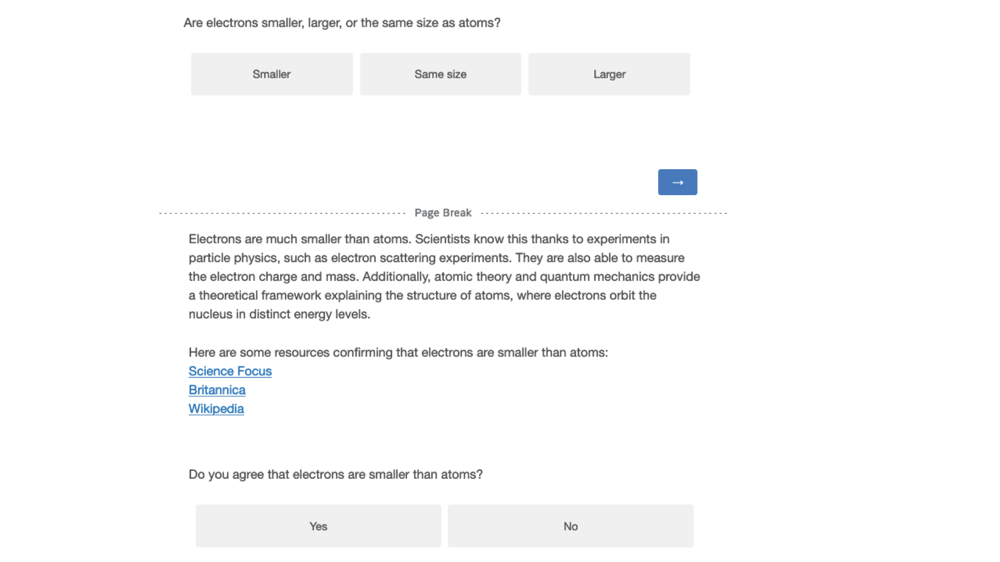
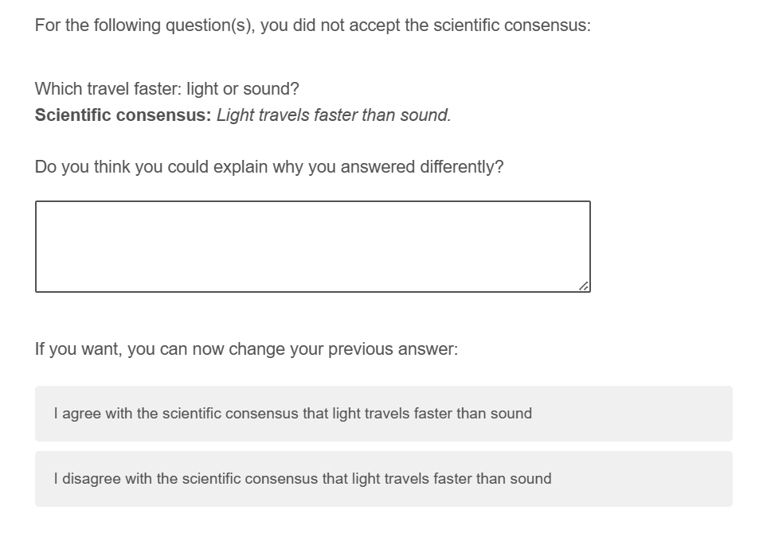

```{r setup, include=FALSE}
# Figure out output format
is_docx <- knitr::pandoc_to("docx") | knitr::pandoc_to("odt")
is_latex <- knitr::pandoc_to("latex")
is_html <- knitr::pandoc_to("html")

# Word-specific things
table_format <- ifelse(is_docx, "huxtable", "kableExtra")  # Huxtable tables
conditional_dpi <- ifelse(is_docx, 300, 300)  # Higher DPI
conditional_align <- ifelse(is_docx, "default", "center")  # Word doesn't support align

# Knitr options
knitr::opts_chunk$set(
  echo = FALSE, warning = FALSE, message = FALSE,
  # tidy.opts = list(width.cutoff = 120),  # Code width
  # fig.retina = 3, dpi = conditional_dpi,
  # fig.width = 7, fig.asp = 0.618,
  # fig.align = conditional_align, out.width = "100%",
  fig.path = "output/figures/",
  cache.path = "output/_cache/",
  fig.process = function(x) {  # Remove "-1" from figure names
    x2 = sub('-\\d+([.][a-z]+)$', '\\1', x)
    if (file.rename(x, x2)) x2 else x
  },
  options(scipen = 99999999)  # Prevent scientific notation
)

# R options
options(
  width = 90,  # Output width
  dplyr.summarise.inform = FALSE,  # Turn off dplyr's summarize() auto messages
  knitr.kable.NA = "",  # Make NAs blank in kables
  kableExtra.latex.load_packages = FALSE,  # Don't add LaTeX preamble stuff
  modelsummary_factory_default = table_format,  # Set modelsummary backend
  modelsummary_format_numeric_latex = "plain"  # Don't use siunitx
)
```

```{r packages, include=FALSE}
# load required packages
library("papaja")      # For APA style manuscript   
library("lme4")        # model specification / estimation
library("lmerTest")    # provides p-values in the output
library("tidyverse")   # data wrangling and visualisation
library("afex")        # anova and deriving p-values from lmer
library("broom")       # extracting data from model fits 
library("broom.mixed") # extracting data from mixed models
library("metafor")     # doing mata analysis
library("patchwork")   # put several plots together
library("ggridges")    # for plots
library("gghalves")    # for plots
library("ggbeeswarm")  # Special distribution-shaped point jittering
library("knitr")       # for tables
library("kableExtra")  # also for tables
library("ggpubr")      # for combining plots with ggarrange() 
library("grid")        # for image plots   
library("gridExtra")   # for image plots
library("png")         # for image plots
library("modelsummary") # for regression tables
```

```{r functions}
# load plot theme
source("functions/plot_theme.R") 

# load other functions
source("functions/own_functions.R")
```

# Introduction

There is increasingly more talk of defiance towards science and towards experts more generally. In every population, many people only trust science ‘some of the time’, and a sizable minority doesn’t trust it.

This appears difficult to reconcile with the fact that, in many countries, most people receive at least a basic science education, that science education (along with education more generally) is increasing, and that science education seems to be the main driver of trust in science. 

But how deep is distrust of science? Do people reject science wholesale, or is it more driven by attitudes towards specific contents, maybe in particular those seen as being politicized, or as going against deeply held beliefs, or behaviors they want to engage in? [previous work suggests that issue-specific claims provoke more negative attitudes]

Here, we look at whether people in the US, across different levels of trust in science (including a sample with anti-vaccine attitudes), accept basic scientific facts.

[We can draw some inspiration from the “Westwood et al 2021 Current research overstates American support for political violence” paper: we want to put in perspective the current rise (? discourse around?) in mistrust towards science]

## Levels of trust in science


## Why do people distrust science?

[here? We know from the many studies on the gateway belief model that people don’t always accept the scientific consensus (indeed, the effect sizes are usually not massive)]

## How much science do people know?

This is a crucial point: if there are questions with specific scientific answers that just about everyone already knows, then in a sense our point is already proven… so the first thing to do would be to look at data on knowledge of science, and see what the highest rates of correct answer is, to see how much room for improvement there is.

“The dominant approach to conceptualizing and measuring science literacy in population surveys has arisen out of work by Jon D. Miller and Kenneth Prewitt in the United States (see Miller, 1983, 1998, 2004) alongside collabora- tors in Great Britain (see Durant et al., 1989). Underlying these efforts appears to have been widespread concern among policy makers and the scientific com- munity that nonscientists were becoming skeptical about the benefits of sci- ence and that such skepticism might result in cuts to science funding that would harm the scientific progress that many argue underpins both American and European economic development (Bauer et al., 2007). The results of the U.S. portion of this work have formed the core of a chapter of a biennial report called Science and Engineering Indicators (hereafter, Indicators) that the National Science Board provides to Congress and the Executive Branch. Scholars have also used the raw data collected for Indicators (which is made publicly available) for peer-reviewed research (e.g., Gauchat, 2012; Losh, 2010), and other countries have used many of the Indicators’ questions for their own national surveys (e.g., Bauer et al., 2012a; National Science Board, 2016).”

# Overview of experiments

The goal is to see to which extent people do not accept basic science.

# Experiment 1

```{r exp1}
# Analyze data of experiments and store results

# Experiment 1

# read the cleaned long version data set
exp1_long <- read_csv("exp_1/data/cleaned_long.csv")

# read wide version data set
exp1_wide <- read_csv("exp_1/data/cleaned_wide.csv") 

# Research questions

# RQ3
cor_trust_knowledge <- cor.test(exp1_wide$wgm_sciencegeneral, exp1_wide$avg_knowledge) %>% text_ready()

cor_trust_acceptance <- cor.test(exp1_wide$wgm_sciencegeneral, exp1_wide$avg_acceptance) %>% text_ready()

# RQ4
cor_conspiracy_knowledge <- cor.test(exp1_wide$BCTI_avg, exp1_wide$avg_knowledge) %>% text_ready()

cor_conspiracy_acceptance <- cor.test(exp1_wide$BCTI_avg, exp1_wide$avg_acceptance)%>% text_ready()

# Exploratory: Acceptance and trust in science/conspiracy thinking conditional on false answers only
exp1_false_knowledge <- exp1_long %>% 
  # make numeric versions
  mutate(acceptance_num = ifelse(acceptance == "Yes", 1, 0)
  ) %>% 
  group_by(id, knowledge) %>% 
  # calculate by-participant averages
  summarize(
    n = n(),
    n_accepted = sum(acceptance_num),
    avg_acceptance  = sum(acceptance_num)/n(), 
    wgm_sciencegeneral = mean(wgm_sciencegeneral), 
    BCTI_avg = mean(BCTI_avg), 
    # add additonal measures for robustness checks
    CMQ_avg = mean(CMQ_avg), 
    SICBS = mean(SICBS),
    wgm_scientists = mean(wgm_scientists), 
    pew = mean(pew)
  ) %>% 
  # filter to only false responses
  filter(knowledge == FALSE) %>% 
  ungroup()

false_answers_cor_trust_acceptance <- cor.test(exp1_false_knowledge$wgm_sciencegeneral, exp1_false_knowledge$avg_acceptance) %>% text_ready()

false_answers_cor_conspiracy_acceptance <- cor.test(exp1_false_knowledge$BCTI_avg, exp1_false_knowledge$avg_acceptance) %>% text_ready()


# extract descriptives for inline reporting
exp1_descriptives <- list(
  # Demographics
  n_subj = n_distinct(exp1_wide$id),
  gender = exp1_wide %>% group_by(gender) %>% summarize(n = n_distinct(id)) %>% split(.$gender),
  age = exp1_wide %>% summarize(across(age,list(mean = mean, median = median, sd = sd), 
                                       .names = "{.fn}")) %>% rounded_numbers(),
  # RQ1 & RQ2
  means = exp1_wide %>% 
    summarize(across(c(avg_knowledge, avg_acceptance), 
                     list(mean = mean, sd = sd), 
                     .names = "{.col}_{.fn}")) %>%
    rename_with(~sub("^avg_", "", .), everything()) %>% 
    mutate_if(is.numeric, round, digits = 2) %>% 
  mutate(across(ends_with("_mean"), ~paste0(.*100, " %"))) ,
  # RQ3
  cor_trust_knowledge = cor_trust_knowledge,
  cor_trust_acceptance = cor_trust_acceptance,
  # RQ4
  cor_conspiracy_knowledge = cor_conspiracy_knowledge,
  cor_conspiracy_acceptance = cor_conspiracy_acceptance, 
  # Exploratory
  # acceptance and knowledge
  conditional_acceptance = exp1_long %>% 
    group_by(knowledge, acceptance) %>% 
    count() %>% 
    group_by(knowledge) %>% 
    mutate (share = n/sum(n), 
            # rename knowledge values
            knowledge = ifelse(knowledge == FALSE, "false", "true")) %>% 
    mutate_if(is.numeric, round, digits = 3) %>% 
    mutate (share = paste0(share*100, " %")) %>% 
    super_split(knowledge, acceptance),
  # acceptance and trust in science/conspiracy thinking
  false_answers_cor_trust_acceptance = false_answers_cor_trust_acceptance,
  false_answers_cor_conspiracy_acceptance = false_answers_cor_conspiracy_acceptance
)
```

The main goal of experiment one was to test whether people would accept the scientific consensus on basic knowledge questions. Additionally, we wanted to know if both science knowledge and acceptance of the scientific consensus are associated with trust in science and conspiracy thinking. We had the following research questions:

**RQ1: What is the average science knowledge score (1)?**

**RQ2: What is the average acceptance of the scientific consensus (2)?**

**RQ3: What is the relationship between trust in science and, respectively, (1) and (2)?**

**RQ4: What is the relationship between conspiracy thinking and, respectively, (1) and (2)?**

## Methods

### Participants

We recruited 200 participants from the US via prolific. 6 participants failed our attention check, resulting in a final sample of `r exp1_descriptives$n_subj` participants (`r exp1_descriptives$gender$female$n` female, `r exp1_descriptives$gender$male$n` male; $age_\text{mean}$: `r exp1_descriptives$age$mean`, $age_\text{sd}$: `r exp1_descriptives$age$sd`, $age_\text{median}$: `r exp1_descriptives$age$median`). Since we did not have any prior assumptions on effect sizes, we did not do a power analysis. 

### Procedure

After providing their consent to participate in the study, participants were given an attention check "While watching the television, have you ever had a fatal heart attack?" [1-6; 1 = Never, 6 = Often]. All participants who did not answer "1 = Never" were excluded. Participants then read the following instructions:"We will ask you 11 questions about science. After each question, we will provide you with the scientifically consensual answer and ask whether you accept it." Next, participants answered a set of 10 basic science questions, which were randomly selected from a pool of 11 questions, in random order. After each question, participants were presented with an answer reflecting the scientific consensus. Participants were asked to choose whether they accept the answer or not, before proceeding to the next question. Figure \@ref(fig:stimulus-example) displays the survey for an example science question. Finally, participants answered questions on conspiracy thinking and trust in science.

(ref:stimulus-example) Example of a science question, the scientific consensus and the corresponding acceptance question.

```{r stimulus-example, echo=FALSE, out.width= "100%", fig.align="left", fig.show="hold", fig.cap="(ref:stimulus-example)"}
knitr::include_graphics("./figures/study1_question_example.png")
```

### Materials

#### Science knowledge and acceptance

Table \@ref(tab:knowledge) shows all questions, their scientifically consensual answer, and their source. All but two questions were selected from existing science knowledge questionnaires. We tried to select non-political questions. 

```{r knowledge}
items <- read_csv("exp_3/materials/overview_questions.csv") %>% 
  mutate(id = 1:nrow(.)) %>% 
  select(id, "Question", "Scientific consensus (Study 1)", "Explanation (Study 2 & 3)") 

# Output the table
kbl(items, booktabs = T, longtable = TRUE,
    caption = "Science knowledge items", 
    full_width = T) %>%
  kable_styling(font_size = 8) %>% 
  column_spec(1, width = "1em") %>%
  column_spec(2, width = "10em") %>%
  column_spec(3, width = "10em") %>%
  column_spec(4, width = "23em") 
```


#### Conspiracy scales

To measure conspiracy thinking, we selected 10 science/health related conspiracy theories from the Belief in Conspiracy Theory Inventory (BCTI) by @pennycookOverconfidentlyConspiratorialConspiracy2022 (Table \@ref(tab:conspiracy)).

```{r conspiracy, echo=FALSE}
# Create the data frame
items <- c(
  "The Apollo moon landings never happened and were staged in a Hollywood film studio.",
  "A cure for cancer was discovered years ago, but this has been suppressed by the pharmaceutical industry and the U.S. Food and Drug Administration (FDA).",
  "The spread of certain viruses and/or diseases is the result of the deliberate, concealed efforts of vested interests.",
  "The claim that the climate is changing due to emissions from fossil fuels is a hoax perpetrated by corrupt scientists who want to spend more taxpayer money on climate research.",
  "The Earth is flat (not spherical) and this fact has been covered up by scientists and vested interests.",
  "There is a causal link between vaccination and autism that has been covered up by the pharmaceutical industry.",
  "In the 1950s and 1960s more than 100 million Americans received a polio vaccine contaminated with a potentially cancer-causing virus.",
  "Proof of alien contact is being concealed from the public.",
  "Hydroxychloroquine has been demonstrated to be a safe and effective treatment of COVID and this information is being suppressed.",
  "Dinosaurs never existed, evolution is not real, and scientists have been faking the fossil record.")

data <- data.frame(id = 1:length(items), items = items)

# Output the table
kbl(data, booktabs = T, longtable = T, col.names = NULL, 
    caption = "Conspiracy items", 
    full_width = F) %>%
  kable_styling(font_size = 8) %>% 
  column_spec(1) %>%
  column_spec(2, width = "40em")
```

To cross-check our results with alternative measures, we also assessed the conspiracy mentality questionnaire (CMQ) by @bruderMeasuringIndividualDifferences2013 and the Single Item Conspiracy Beliefs Scale (SICBS) by @lantianMeasuringBeliefConspiracy2016 (see Appendix \@ref(exp1)). 

#### Trust in science

Our main item for measuring trust in science is selected from the Wellcome Global Monitor survey: "In general, would you say that you trust science a lot, some, not much, or not at all? [1 = Not at all, 2 = Not much, 3 = Some, 4 = A lot]"

We also included two additional trust questions, one also from the Wellcome Global Monitor (WGM) survey ("How much do you trust scientists in this country? Do you trust them a lot, some, not much, or not at all? [1 = Not at all, 2 = Not much, 3 = Some, 4 = A lot]"), the other from the Pew research center ("How much confidence do you have in scientists to act in the best interests of the public? [1-5; 1 = No confidence at all, 5 = A great deal of confidence]"). We selected these items so that we could compare the ratings in our sample to global survey results. The WGM survey has been administered in over 140 countries and included over 140000 respondents. The Pew question has recently been used by a world-wide many labs study in 67 countries with 71417 respondents [@colognaTrustScientistsTheir2024]. 

## Results 

Regarding RQ1 and RQ2, participants answered on average `r exp1_descriptives$means$knowledge_mean` (sd = `r exp1_descriptives$means$knowledge_sd`) of the questions correctly, and accepted the scientific consensus on average for `r exp1_descriptives$means$acceptance_mean` (sd = `r exp1_descriptives$means$acceptance_sd`) of the questions.

Fig. \@ref(fig:exp1-conditional-acceptance) illustrates the relationship between knowledge and acceptance. In most cases (`r exp1_descriptives$conditional_acceptance$false$Yes$share`), participants readily accepted the scientific consensus after having given the wrong answer to a question. In very few cases (`r exp1_descriptives$conditional_acceptance$true$No$share`), participants who gave the correct response afterwards rejected the scientific consensus, thereby contradicting their own initial response. We believe this might have been due to inattention.

(ref:exp1-conditional-acceptance) Acceptance rates of scientific consensus, based on whether the initial response to the knowledge question was false or true.

```{r exp1-conditional-acceptance, fig.cap="(ref:exp1-conditional-acceptance)"}
plot_data <- exp1_long %>% 
  group_by(knowledge, acceptance) %>% 
  count() %>% 
  group_by(knowledge) %>% 
  mutate (share = n/sum(n)) %>% 
  mutate_if(is.numeric, round, digits = 3)

absolute_numbers <- plot_data %>% 
  group_by(knowledge) %>% 
  summarise(n = sum(n))


ggplot(plot_data, aes(x = knowledge, y = share, fill = acceptance)) +
  geom_col(position = "dodge") +
  scale_y_continuous(labels = scales::percent_format(), breaks = seq(0, 1, 0.1)) +
  geom_text(aes(label = paste0(round(share * 100, 1), "%")),
            position = position_dodge(width = 0.9),
            vjust = -0.5, size = 3) +
  scale_fill_viridis_d(option = "cividis") +
  labs(x = "Knowledge answer", fill = "Acceptance \nof consensus") +
  plot_theme +
  geom_bracket(data = absolute_numbers,
               aes(xmin = as.numeric(factor(knowledge)) - 0.4, 
                   xmax = as.numeric(factor(knowledge)) + 0.4, 
                   y.position = 1.05, label =  paste0("n = ", n)),
               inherit.aes = FALSE,
               step.increase = 0)
```

For RQ3, we find a positive but small correlation between both science knowledge and trust in science (r = `r exp1_descriptives$cor_trust_knowledge$estimate`, p `r exp1_descriptives$cor_trust_knowledge$p.value`), and acceptance of scientific consensus and trust in science (r = `r exp1_descriptives$cor_trust_acceptance$estimate`, p `r exp1_descriptives$cor_trust_acceptance$p.value`). The more people are knowledgeable about science and the more they tend to accept the scientific consensus, the more they tend to trust science. These correlations are relatively weak, which might be partly due to ceiling effects: As illustrated in Fig. \@ref(fig:exp1-plot), (i) most people do trust science, and (ii) that is true even among people with low knowledge or acceptance rates. 

For RQ4, we find a negative correlation of similar magnitude between conspiracy thinking and science knowledge (r = `r exp1_descriptives$cor_conspiracy_knowledge$estimate`, p `r exp1_descriptives$cor_conspiracy_knowledge$p.value`), and conspiracy thinking and acceptance of scientific consensus (r = `r exp1_descriptives$cor_conspiracy_acceptance$estimate`, p `r exp1_descriptives$cor_conspiracy_acceptance$p.value`).

In Appendix \@ref(exp1), we show that these associations are robust when using alternative measures of trust and conspiracy thinking. Appendix \@ref(exp1) also includes more descriptive statistics, such as knowledge and acceptance by science questions.

Are trust in science and conspiracy thinking, respectively, associated with being more easily convinced of the scientific consensus? In our main analyses, we looked at correlations of acceptance across all observations. One possibility is that the associations between trust in science/conspiracy thinking and acceptance of scientific consensus are explained by science knowledge: People who give the right answer in the first place are more ready to accept the consensus, and trust in science/conspiracy thinking are mostly associated with this knowledge, but not with willingness to accept the consensus. To addressed this potential confound, in a non-preregistered analysis, we restricted our sample to cases where participants gave the wrong answer to the knowledge question. We than calculated the correlation between trust in science and average acceptance rate by participant. We find no statistically significant correlation of acceptance with neither conspiracy thinking (r = `r exp1_descriptives$false_answers_cor_conspiracy_acceptance$estimate`, p `r exp1_descriptives$false_answers_cor_conspiracy_acceptance$p.value`), nor with trust in science (r = `r exp1_descriptives$false_answers_cor_trust_acceptance$estimate`, p `r exp1_descriptives$false_answers_cor_trust_acceptance$p.value`). 

(ref:exp1-plot) **A** Shows the distribution of science knowledge (left) and acceptance of scientific consensus  **B** Shows the relationship between trust in science and science knowledge/acceptance of scientific consensus **C** Shows the relationship between conspiracy thinking and science knowledge/acceptance of scientific consensus

```{r exp1-plot, fig.cap="(ref:exp1-plot)", fig.height= 10, fig.width=10}
# Plot distributions of knowledge and acceptance and their mean

mean_value_knowledge <- mean(exp1_wide$avg_knowledge)
max_n <- max(table(exp1_wide$avg_acceptance))

knowledge_mean <- ggplot(exp1_wide, aes(x = avg_knowledge)) +
  geom_bar() + 
  geom_vline(xintercept = mean_value_knowledge, color = "red", linetype = "dashed") +
  geom_text(aes(x = mean_value_knowledge, y = 40, label = paste("Mean =", round(mean_value_knowledge, 2))), 
            vjust = -0.5, hjust = 1.2, check_overlap = TRUE) +
  scale_x_continuous(breaks = seq(0, 1, 0.1)) +
  scale_y_continuous(breaks = seq(0, max_n, 10)) +
  coord_cartesian(xlim = c(0, 1), 
                  ylim = c(0, max_n)) +
  labs(x = "Average science knowledge", 
       y = "N")

mean_value <- mean(exp1_wide$avg_acceptance)

acceptance_mean <- ggplot(exp1_wide, aes(x = avg_acceptance)) +
  geom_bar() + 
  geom_vline(xintercept = mean_value, color = "red", linetype = "dashed") +
  geom_text(aes(x = mean_value, y = 60, label = paste("Mean =", round(mean_value, 2))), 
            vjust = -0.5, hjust = 1.2, check_overlap = TRUE) +
  scale_x_continuous(breaks = seq(0, 1, 0.1)) +
  scale_y_continuous(breaks = seq(0, max_n, 10)) +
  coord_cartesian(xlim = c(0, 1), 
                  ylim = c(0, max_n)) +
  labs(x = "Average consensus acceptance", 
       y = "N")

# Trust in science plots
plot_data <- exp1_wide %>% 
  group_by(wgm_sciencegeneral, avg_knowledge) %>% 
  summarise(n = n())

trust_knowledge <- ggplot(plot_data, aes(x = avg_knowledge, y = wgm_sciencegeneral, fill = n)) +
  geom_tile() +  # Add black border around tiles for better visibility
  geom_jitter(inherit.aes = FALSE, data = exp1_wide, aes(x = avg_knowledge, y = wgm_sciencegeneral),
              width = 0.03, height = 0.08) +  # Scatter points within each tile
  scale_fill_viridis_c(option = "plasma") +  # Use Viridis color scale (Plasma)
  scale_x_continuous(breaks = seq(0, 1, 0.1)) +
  coord_cartesian(xlim = c(0, 1)) +
  scale_y_continuous(breaks = 1:5) +
  labs(x = "Average science knowledge", 
       y = "Trust in science", 
       fill = "N")

plot_data <- exp1_wide %>% 
  group_by(wgm_sciencegeneral, avg_acceptance) %>% 
  summarise(n = n())


trust_acceptance <- ggplot(plot_data, aes(x = avg_acceptance, y = wgm_sciencegeneral, fill = n)) +
  geom_tile() +  
  geom_jitter(inherit.aes = FALSE, data = exp1_wide, aes(x = avg_acceptance, y = wgm_sciencegeneral),
              width = 0.03, height = 0.08) + 
  scale_fill_viridis_c(option = "plasma") + 
  scale_x_continuous(breaks = seq(0, 1, 0.1)) +
  coord_cartesian(xlim = c(0, 1)) +
  scale_y_continuous(breaks = 1:5) +
  labs(x = "Average consensus Acceptance", 
       y = "Trust in science", 
       fill = "N") +
  theme(legend.position = "top")

# Conspiracy Thinking plots

conspiracy_knowledge <- ggplot(exp1_wide, aes(x = avg_knowledge, y = BCTI_avg)) +
  geom_point() +
  geom_smooth(method = "lm") +
  scale_x_continuous(breaks = seq(0, 1, 0.1)) +
  scale_y_continuous(breaks = 1:9) +
  coord_cartesian(xlim = c(0, 1), 
                  ylim = c(0, 9)) +
  labs(x = "Average science knowledge", 
       y = "Average conspiracy thinking")

conspiracy_acceptance <- ggplot(exp1_wide, aes(x = avg_acceptance, y = BCTI_avg)) +
  geom_point() +
  geom_smooth(method = "lm") +
  scale_x_continuous(breaks = seq(0, 1, 0.1)) +
  scale_y_continuous(breaks = 1:9) +
  coord_cartesian(xlim = c(0, 1), 
                  ylim = c(0, 9)) +
  labs(x = "Average consensus acceptance", 
       y = "Average conspiracy thinking") +
  theme(legend.position = "top")

# Combine plots

# distributions
distributions <- ggarrange(knowledge_mean + 
                             rremove("xlab") , 
                           acceptance_mean + 
                             rremove("xlab") +
                             rremove("ylab")) 

# trust
trust <- ggarrange(trust_knowledge + 
                             rremove("xlab") +
                             guides(fill = "none") +
                             labs(caption = NULL) , 
                           trust_acceptance + 
                             rremove("xlab") +
                             rremove("ylab"), 
                   common.legend = TRUE) 

# conspiracy
conspiracy <- ggarrange(conspiracy_knowledge, 
                           conspiracy_acceptance + 
                             rremove("ylab"), 
                   common.legend = TRUE) 


# common plot
patchwork <- (distributions / trust / conspiracy) + 
  plot_annotation(tag_levels = 'A')  

patchwork

```

## Discussion

These results suggest that most people accept the scientific consensus most of the time. Even when people do not know the correct answer to a science question, they tend to mostly accept the scientific consensus afterwards. Yet, in `r exp1_descriptives$conditional_acceptance$false$No$share` of the cases, participants rejected the scientific consensus after having given the wrong answer, suggesting that simply stating the consensus is not sufficient to convince participants sometimes. In general, people with lower trust in science and who believe more in conspiracy theories tend to both know less about science and accept the scientific consensus less. 

# Experiment 2

```{r exp2}
# Analyze data of experiments and store results

# Experiment 2

# read the cleaned long version data set
exp2_long <- read_csv("exp_2/data/cleaned_long.csv")

# read wide version data set
exp2_wide <- read_csv("exp_2/data/cleaned_wide.csv") 

# read coded justifications
exp2_justifications <- read_csv("exp_2/data/justifications_clean.csv")

# Research questions

# H1a
cor_trust_knowledge <- cor.test(exp2_wide$wgm_sciencegeneral, exp2_wide$avg_knowledge) %>% text_ready()

# H2a
cor_conspiracy_knowledge <- cor.test(exp2_wide$BCTI_avg, exp2_wide$avg_knowledge) %>% text_ready()

# Exploratory: Acceptance and trust in science/conspiracy thinking conditional on false answers only
exp2_false_knowledge <- exp2_long %>% 
  # make numeric versions
  mutate(acceptance_num = ifelse(acceptance == "Yes", 1, 0)
  ) %>% 
  group_by(id, knowledge) %>% 
  # calculate by-participant averages
  summarize(
    n = n(),
    n_accepted = sum(acceptance_num),
    avg_acceptance  = sum(acceptance_num)/n(), 
    wgm_sciencegeneral = mean(wgm_sciencegeneral), 
    BCTI_avg = mean(BCTI_avg), 
    # add additonal measures for robustness checks
    CMQ_avg = mean(CMQ_avg), 
    SICBS = mean(SICBS),
    wgm_scientists = mean(wgm_scientists), 
    pew = mean(pew)
  ) %>% 
  # filter to only false responses
  filter(knowledge == FALSE) %>% 
  ungroup()

# H1b
# conditional on false answers
false_answers_cor_trust_acceptance <- cor.test(exp2_false_knowledge$wgm_sciencegeneral, exp2_false_knowledge$avg_acceptance) %>% text_ready()

# pooled across all cases
cor_trust_acceptance <- cor.test(exp2_wide$wgm_sciencegeneral, exp2_wide$avg_acceptance) %>% text_ready()

# H2b
# conditional on false answers
false_answers_cor_conspiracy_acceptance <- cor.test(exp2_false_knowledge$BCTI_avg, exp2_false_knowledge$avg_acceptance) %>% text_ready()

# pooled across all cases
cor_conspiracy_acceptance <- cor.test(exp2_wide$BCTI_avg, exp2_wide$avg_acceptance) %>% text_ready()


# extract descriptives for inline reporting
exp2_descriptives <- list(
  # Demographics
  n_subj = n_distinct(exp2_wide$id),
  gender = exp2_wide %>% group_by(gender) %>% summarize(n = n_distinct(id)) %>% split(.$gender),
  age = exp2_wide %>% summarize(across(age,list(mean = mean, median = median, sd = sd), 
                                       .names = "{.fn}")) %>% rounded_numbers(),
  # RQ1 & RQ2
  means = exp2_wide %>% 
    summarize(across(c(avg_knowledge, avg_acceptance), 
                     list(mean = mean, sd = sd), 
                     .names = "{.col}_{.fn}")) %>%
    rename_with(~sub("^avg_", "", .), everything()) %>% 
    mutate_if(is.numeric, round, digits = 2) %>% 
  mutate(across(ends_with("_mean"), ~paste0(.*100, " %"))) ,
  # H1
  # a
  cor_trust_knowledge = cor_trust_knowledge,
  # b (conditional on false responses)
  false_answers_cor_trust_acceptance = false_answers_cor_trust_acceptance,
  # b (all cases)
  cor_trust_acceptance = cor_trust_acceptance,
  # H2
  # a
  cor_conspiracy_knowledge = cor_conspiracy_knowledge,
  # b (conditional on false responses)
  false_answers_cor_conspiracy_acceptance = false_answers_cor_conspiracy_acceptance,
  # b(all cases)
  cor_conspiracy_acceptance = cor_conspiracy_acceptance, 
  # Exploratory
  # acceptance and knowledge
  conditional_acceptance = exp2_long %>% 
    group_by(knowledge, acceptance) %>% 
    count() %>% 
    group_by(knowledge) %>% 
    mutate (share = n/sum(n), 
            # rename knowledge values
            knowledge = ifelse(knowledge == FALSE, "false", "true")) %>% 
    mutate_if(is.numeric, round, digits = 3) %>% 
    mutate (share = paste0(share*100, " %")) %>% 
    super_split(knowledge, acceptance),
  # Justifications
  justifications_n = nrow(exp2_justifications), 
  justifications_n_participants = n_distinct(exp2_justifications$id),
  justification_by_category = exp2_justifications %>%
    group_by(category)%>%
    summarize(n = n(), 
              n_subjects = n_distinct(id)) %>%
    mutate(share = n/sum(n)) %>%
    mutate_if(is.numeric, round, digits=3) %>% 
    mutate(share = paste0(share*100, "%")) %>% 
    split(.$category)
)
```

In experiment 1, we tested whether participants would accept the scientific consensus on basic science facts. In most instances they did, but not always. In experiment 2, we wanted to test whether this reluctance was because of participants not trusting us as a source of consensual science knowledge. To do so, we added an explanation and sources to each consensus statement, instead of only stating the consensus. To better understand reasons for consensus rejection, after having answered all questions, we asked participants an open-ended question to explain why they rejected the consensus, for each question on which they did so. We also excluded the where do trees their materials from, as this question clearly seemed to be an outlier where most participants would get the answer wrong (see Appendix \@ref(exp1)).

Based on experiment 1, we formulated the following hypotheses: 

**H1a: Higher trust in science is associated with more science knowledge?**

**H1b: Higher trust in science is associated with more acceptance of the scientific consensus, for participants who did not already know it?**

**H2a: Higher conspiracy thinking is associated with less science knowledge?**

**H2b: Higher conspiracy thinking is associated with less acceptance of the scientific consensus, for participants who did not already know it?**

We had the following research questions:

**RQ1: What is the average science knowledge score?**

**RQ2: When a participant’s answer does not match the consensus, how often do they change their mind and accept the consensus?**

**RQ3: What reasons do participants provide to justify their rejection of the scientific consensus?**

## Methods

### Participants

We recruited 201 participants from the US via prolific. 11 participants failed our attention check, resulting in a final sample of `r exp2_descriptives$n_subj` participants (`r exp2_descriptives$gender$female$n` female, `r exp2_descriptives$gender$male$n` male; $age_\text{mean}$: `r exp2_descriptives$age$mean`, $age_\text{sd}$: `r exp2_descriptives$age$sd`, $age_\text{median}$: `r exp2_descriptives$age$median`). Since we did not have any prior assumptions on effect sizes and our analyses were descriptive, we did not do a power analysis. 

### Procedure

The procedure was the same as in experiment 1, with the difference that, instead of just stating the scientific consensus, participants were presented with a short explanation which we wrote, partly based on explanations generated by ChatGPT, and three links to authoritative sources supporting the answer (Fig. \@ref(fig:exp2-stimulus-example).

(ref:exp2-stimulus-example) Example of a science question, the scientific consensus and corresponding explanation and sources.

```{r exp2-stimulus-example, echo=FALSE, out.width= "100%", fig.align="left", fig.show="hold", fig.cap="(ref:exp2-stimulus-example)"}

```

### Materials

We relied on the same items as in experiment 1. The only difference was that we removed the question on trees. 

## Results 

As in experiment 1, we find a positive but small correlation between science knowledge and trust in science (H1a: r = `r exp2_descriptives$cor_trust_knowledge$estimate`, p `r exp2_descriptives$cor_trust_knowledge$p.value`) and a small negative correlation between science knowledge and conspiracy thinking (H2a: r = `r exp2_descriptives$cor_conspiracy_knowledge$estimate`, p `r exp2_descriptives$cor_conspiracy_knowledge$p.value`). By contrast to experiment 1, we conditioned on initially false answers when looking at the relationship of consensus acceptance with trust in science and conspiracy thinking, respectively. For trust in science, we find no statistically significant correlation (r = `r exp2_descriptives$false_answers_cor_trust_acceptance$estimate`, p `r exp2_descriptives$false_answers_cor_trust_acceptance$p.value`). For conspiracy thinking we find a small negative one (r = `r exp2_descriptives$false_answers_cor_conspiracy_acceptance$estimate`, p `r exp2_descriptives$false_answers_cor_conspiracy_acceptance$p.value`).

(ref:exp2-conditional-acceptance) Acceptance rates of scientific consensus, based on whether the initial response to the knowledge question was false or true.

```{r exp2-conditional-acceptance, fig.cap="(ref:exp2-conditional-acceptance)"}
plot_data <- exp2_long %>% 
  group_by(knowledge, acceptance) %>% 
  count() %>% 
  group_by(knowledge) %>% 
  mutate (share = n/sum(n)) %>% 
  mutate_if(is.numeric, round, digits = 3)

absolute_numbers <- plot_data %>% 
  group_by(knowledge) %>% 
  summarise(n = sum(n))


ggplot(plot_data, aes(x = knowledge, y = share, fill = acceptance)) +
  geom_col(position = "dodge") +
  scale_y_continuous(labels = scales::percent_format(), breaks = seq(0, 1, 0.1)) +
  geom_text(aes(label = paste0(round(share * 100, 1), "%")),
            position = position_dodge(width = 0.9),
            vjust = -0.5, size = 3) +
  scale_fill_viridis_d(option = "cividis") +
  labs(x = "Knowledge answer", fill = "Acceptance \nof consensus") +
  plot_theme  +
  geom_bracket(data = absolute_numbers,
               aes(xmin = as.numeric(factor(knowledge)) - 0.4, 
                   xmax = as.numeric(factor(knowledge)) + 0.4, 
                   y.position = 1.05, label =  paste0("n = ", n)),
               inherit.aes = FALSE,
               step.increase = 0)
```

Confirming results from experiment 1, we find that the more people are knowledgeable about science and the more they tend to accept the scientific consensus even when they are not that knowledgeable in science, the more they tend to trust science. These correlations are relatively weak, which might be partly due to ceiling effects: As illustrated in Fig. \@ref(fig:exp2-plot), (i) most people do trust science, and (ii) that is true even among people with low knowledge or acceptance rates. In Appendix \@ref(exp2) we show that these results hold for our alternative measures of trust and conspiracy thinking. We also include more descriptive statistics, such as knowledge and acceptance by science questions.

Regarding RQ1, participants answered on average `r exp2_descriptives$means$knowledge_mean` (sd = `r exp2_descriptives$means$knowledge_sd`) of the questions correctly, and accepted the scientific consensus on average for `r exp2_descriptives$means$acceptance_mean` (sd = `r exp2_descriptives$means$acceptance_sd`) of the questions. Fig. \@ref(fig:exp2-conditional-acceptance) illustrates the relationship between knowledge and acceptance. In response to RQ2, in most cases (`r exp2_descriptives$conditional_acceptance$false$Yes$share`), participants readily accepted the scientific consensus after having initially given the wrong answer to a question. In very few cases (`r exp2_descriptives$conditional_acceptance$true$No$share`), participants who gave the correct response afterwards rejected the scientific consensus, thereby contradicting their own initial response.

(ref:exp2-plot) **A** Shows the distribution of science knowledge (left) and acceptance of scientific consensus for participants who gave the wrong answer **B** Shows the relationship between trust in science and science knowledge/acceptance (if wrong at first, rounded to the first digit) of scientific consensus **C** Shows the relationship between conspiracy thinking and science knowledge/acceptance (if wrong at first) of scientific consensus

```{r exp2-plot, fig.cap="(ref:exp2-plot)", fig.height= 12, fig.width=12}
# Plot distributions of knowledge and acceptance and their mean

mean_value_knowledge <- mean(exp2_wide$avg_knowledge)
max_n <- max(table(exp2_wide$avg_acceptance))

knowledge_mean <- ggplot(exp2_wide, aes(x = avg_knowledge)) +
  geom_bar() + 
  geom_vline(xintercept = mean_value_knowledge, color = "red", linetype = "dashed") +
  geom_text(aes(x = mean_value_knowledge, y = 40, label = paste("Mean =", round(mean_value_knowledge, 2))), 
            vjust = -0.5, hjust = 1.2, check_overlap = TRUE) +
  scale_x_continuous(breaks = seq(0, 1, 0.1)) +
  scale_y_continuous(breaks = seq(0, max_n, 10)) +
  coord_cartesian(xlim = c(0, 1), 
                  ylim = c(0, max_n)) +
  labs(x = "Average science knowledge", 
       y = "N")

mean_value <- mean(exp2_wide$avg_acceptance)

acceptance_mean <- ggplot(exp2_wide, aes(x = avg_acceptance)) +
  geom_bar() + 
  geom_vline(xintercept = mean_value, color = "red", linetype = "dashed") +
  geom_text(aes(x = mean_value, y = 60, label = paste("Mean =", round(mean_value, 2))), 
            vjust = -0.5, hjust = 1.2, check_overlap = TRUE) +
  scale_x_continuous(breaks = seq(0, 1, 0.1)) +
  scale_y_continuous(breaks = seq(0, max_n, 10)) +
  coord_cartesian(xlim = c(0, 1), 
                  ylim = c(0, max_n)) +
  labs(x = "Average consensus acceptance", 
       y = "N")

# Trust in science plots
plot_data <- exp2_wide %>% 
  group_by(wgm_sciencegeneral, avg_knowledge) %>% 
  summarise(n = n())

trust_knowledge <- ggplot(plot_data, aes(x = avg_knowledge, y = wgm_sciencegeneral, fill = n)) +
  geom_tile() +  # Add black border around tiles for better visibility
  geom_jitter(inherit.aes = FALSE, data = exp2_wide, aes(x = avg_knowledge, y = wgm_sciencegeneral),
              width = 0.03, height = 0.08) +  # Scatter points within each tile
  scale_fill_viridis_c(option = "plasma") +  # Use Viridis color scale (Plasma)
  scale_x_continuous(breaks = seq(0, 1, 0.1)) +
  coord_cartesian(xlim = c(0, 1)) +
  scale_y_continuous(breaks = 1:5) +
  labs(x = "Average science knowledge", 
       y = "Trust in science", 
       fill = "N")

plot_data <- exp2_wide %>% 
  group_by(wgm_sciencegeneral, avg_acceptance) %>% 
  summarise(n = n())


trust_acceptance <- ggplot(plot_data, aes(x = avg_acceptance, y = wgm_sciencegeneral, fill = n)) +
  geom_tile() +  
  geom_jitter(inherit.aes = FALSE, data = exp2_wide, aes(x = avg_acceptance, y = wgm_sciencegeneral),
              width = 0.03, height = 0.08) + 
  scale_fill_viridis_c(option = "plasma") + 
  scale_x_continuous(breaks = seq(0, 1, 0.1)) +
  coord_cartesian(xlim = c(0, 1)) +
  scale_y_continuous(breaks = 1:5) +
  labs(x = "Average consensus Acceptance", 
       y = "Trust in science", 
       fill = "N") +
  theme(legend.position = "top")

# Conspiracy Thinking plots

conspiracy_knowledge <- ggplot(exp2_wide, aes(x = avg_knowledge, y = BCTI_avg)) +
  geom_point() +
  geom_smooth(method = "lm") +
  scale_x_continuous(breaks = seq(0, 1, 0.1)) +
  scale_y_continuous(breaks = 1:9) +
  coord_cartesian(xlim = c(0, 1), 
                  ylim = c(0, 9)) +
  labs(x = "Average science knowledge", 
       y = "Average conspiracy thinking")

conspiracy_acceptance <- ggplot(exp2_wide, aes(x = avg_acceptance, y = BCTI_avg)) +
  geom_point() +
  geom_smooth(method = "lm") +
  scale_x_continuous(breaks = seq(0, 1, 0.1)) +
  scale_y_continuous(breaks = 1:9) +
  coord_cartesian(xlim = c(0, 1), 
                  ylim = c(0, 9)) +
  labs(x = "Average consensus acceptance", 
       y = "Average conspiracy thinking") +
  theme(legend.position = "top")

# Combine plots

# distributions
distributions <- ggarrange(knowledge_mean + 
                             rremove("xlab") , 
                           acceptance_mean + 
                             rremove("xlab") +
                             rremove("ylab")) 

# trust
trust <- ggarrange(trust_knowledge + 
                             rremove("xlab") +
                             guides(fill = "none") +
                             labs(caption = NULL) , 
                           trust_acceptance + 
                             rremove("xlab") +
                             rremove("ylab"), 
                   common.legend = TRUE) 

# conspiracy
conspiracy <- ggarrange(conspiracy_knowledge, 
                           conspiracy_acceptance + 
                             rremove("ylab"), 
                   common.legend = TRUE) 


# common plot
patchwork <- (distributions / trust / conspiracy) + 
  plot_annotation(tag_levels = 'A')  

patchwork
```


For RQ3, we got `r exp2_descriptives$justifications_n` answers from `r exp2_descriptives$justifications_n_participants` different participants to the open-ended questions on why they had rejected the scientific consensus on a particular question. Table \@ref(tab:exp2-justifications) summarizes these answers by five categories. All answers can be read in Appendix \@ref(exp2).  

```{r exp2-justifications}
exp2_justifications %>%
  group_by(category)%>%
  summarize(n = n(), 
            n_subjects = n_distinct(id)) %>%
  mutate(Share = n/sum(n)) %>%
  mutate_if(is.numeric, round, digits=3) %>% 
  mutate(Share = paste0(Share*100, "%")) %>% 
  arrange(desc(n)) %>% 
  select(category, n, Share, n_subjects) %>% 
  rename(Category = category,
         `N (instances)` = n, 
         `Share (instances)` = Share, 
         `N (unique participants)` = n_subjects
         ) %>% 
  apa_table(caption = "Justifications by category")
```

## Discussion

Similar to experiment 1, most people (i) do know and agree with the scientific consensus, and (ii) tend to accept the scientific consent even if they were not previously aware of it (i.e. answered the knowledge question wrongly). The share of these latter is considerably larger in experiment 2 (`r exp2_descriptives$conditional_acceptance$false$Yes$share`) than in experiment 1 (`r exp1_descriptives$conditional_acceptance$false$Yes$share`). While this could be just sampling variation, it might be that adding explanations and sources convinced people more than merely stating the consensus. We also show, again, that people with lower trust in science and who believe more in conspiracy theories tend to both know less about science and accept the scientific consensus less.

# Experiment 3

```{r exp3}
# Analyze data of experiments and store results

# Experiment 3

# read the cleaned long version data set
exp3_long <- read_csv("exp_3/data/cleaned_long.csv")

# read wide version data set
exp3_wide <- read_csv("exp_3/data/cleaned_wide.csv") 

# read coded justifications
exp3_justifications <- read_csv("exp_3/data/justifications_clean.csv")

# Research questions

# H1
cor_trust_knowledge <- cor.test(exp3_wide$wgm_sciencegeneral, exp3_wide$avg_knowledge,
  use = "complete.obs") %>% text_ready()
cor_trust_acceptance <- cor.test(exp3_wide$wgm_sciencegeneral, exp3_wide$avg_acceptance,
  use = "complete.obs") %>% text_ready()

# H2
cor_conspiracy_knowledge <- cor.test(exp3_wide$BCTI_avg, exp3_wide$avg_knowledge,
  use = "complete.obs") %>% text_ready()
cor_conspiracy_acceptance <- cor.test(exp3_wide$BCTI_avg, exp3_wide$avg_acceptance,
  use = "complete.obs") %>% text_ready()

# Exploratory: Acceptance and trust in science/conspiracy thinking conditional on false answers only
exp3_false_knowledge <- exp3_long %>% 
  # make numeric versions
  mutate(acceptance_num = ifelse(acceptance == "Yes", 1, 0)
  ) %>% 
  group_by(id, knowledge) %>% 
  # calculate by-participant averages
  summarize(
    n = n(),
    n_accepted = sum(acceptance_num),
    avg_acceptance  = sum(acceptance_num)/n(), 
    wgm_sciencegeneral = mean(wgm_sciencegeneral), 
    BCTI_avg = mean(BCTI_avg), 
    # add additonal measures for robustness checks
    CMQ_avg = mean(CMQ_avg), 
    SICBS = mean(SICBS),
    wgm_scientists = mean(wgm_scientists), 
    pew = mean(pew)
  ) %>% 
  # filter to only false responses
  filter(knowledge == FALSE) %>% 
  ungroup()

# H1b conditional on false answers
false_answers_cor_trust_acceptance <- cor.test(exp3_false_knowledge$wgm_sciencegeneral, exp3_false_knowledge$avg_acceptance,
  use = "complete.obs") %>% 
  text_ready()

# H2b conditional on false answers
false_answers_cor_conspiracy_acceptance <- cor.test(exp3_false_knowledge$BCTI_avg, exp3_false_knowledge$avg_acceptance,
  use = "complete.obs") %>% 
  text_ready()

# extract descriptives for inline reporting
exp3_descriptives <- list(
  # Demographics
  n_subj = n_distinct(exp3_wide$id),
  n_subject_by_outcome = exp3_wide %>% 
    summarize(across(c("wgm_scientists", "reason_agreement", "BCTI_avg"), 
                     ~sum(!is.na(.x)
                     )
    )
    ),
  gender = exp3_wide %>% group_by(gender) %>% summarize(n = n_distinct(id)) %>% split(.$gender),
  age = exp3_wide %>% summarize(across(age,list(mean = mean, median = median, sd = sd), 
                                       .names = "{.fn}")) %>% rounded_numbers(),
  # RQ1 & RQ2
  means = exp3_wide %>% 
    summarize(across(c(avg_knowledge, avg_acceptance, avg_acceptance_initial), 
                     list(mean = mean, sd = sd), 
                     .names = "{.col}_{.fn}")) %>%
    rename_with(~sub("^avg_", "", .), everything()) %>% 
    mutate_if(is.numeric, round, digits = 2) %>% 
  mutate(across(ends_with("_mean"), ~paste0(.*100, " %"))) ,
  # H1
  # a
  cor_trust_knowledge = cor_trust_knowledge,
  # b (conditional on false responses)
  false_answers_cor_trust_acceptance = false_answers_cor_trust_acceptance,
  # b (all cases)
  cor_trust_acceptance = cor_trust_acceptance,
  # H2
  # a
  cor_conspiracy_knowledge = cor_conspiracy_knowledge,
  # b (conditional on false responses)
  false_answers_cor_conspiracy_acceptance = false_answers_cor_conspiracy_acceptance,
  # b(all cases)
  cor_conspiracy_acceptance = cor_conspiracy_acceptance, 
  # Exploratory
  # acceptance and knowledge
  conditional_acceptance = exp3_long %>% 
    pivot_longer(c(acceptance, acceptance_initial), 
                 names_to = "measure", 
                 values_to = "acceptance") %>% 
    group_by(knowledge, measure, acceptance) %>% 
    count() %>% 
    group_by(knowledge, measure) %>% 
    mutate (share = n/sum(n), 
            # rename knowledge values
            knowledge = ifelse(knowledge == FALSE, "false", "true")) %>% 
    mutate_if(is.numeric, round, digits = 3) %>% 
    mutate (share = paste0(share*100, " %")) %>% 
    super_split(knowledge,  measure, acceptance),
  # Justifications
  justifications_n = nrow(exp3_justifications), 
  justifications_n_participants = n_distinct(exp3_justifications$id),
  justification_by_category = exp3_justifications %>%
    group_by(category)%>%
    summarize(n = n(), 
              n_subjects = n_distinct(id)) %>%
    mutate(share = n/sum(n)) %>%
    mutate_if(is.numeric, round, digits=3) %>% 
    mutate(share = paste0(share*100, "%")) %>% 
    split(.$category),
  # Consensus acceptance
  acceptance_n = exp3_wide %>% 
    filter(!is.na(reason_agreement)) %>% 
    nrow(.),
  acceptance_by_reason = exp3_wide %>% 
    group_by(reason_agreement) %>% 
    summarize(n = n()) %>%
    drop_na(reason_agreement) %>% 
    mutate(share = n/sum(n)) %>%
    mutate_if(is.numeric, round, digits=3) %>% 
    mutate(share = paste0(share*100, "%")) %>% 
    split(.$reason_agreement),
  reason_followup_n = exp3_wide %>% 
    filter(!is.na(reason_followup)) %>% 
    nrow(.)
)

```

Study 3 is essentially a replication-–with some minor modifications-–of study 2, but on a different type of sample. Both study 1 and 2 were run on convenience samples. For study 3, we recruited a sample of people holding anti-vaccination beliefs (see below). By contrast to study 2, after asking participants an open question about why they did not accept the consensus (in cases where they didn't), we provide them with an explicit opportunity to change their answer (Fig. \@ref(fig:exp3-explanation-example)). Based on the answers to the open-ended questions, we also pre-registered a categorization scheme of reasons why people rejected the consensus. Finally, we also ask participants about why they agree with the scientific consensus on certain questions, in case they do. We want to know if participants perceive that this is because of trust, or other factors.

As for study 2 (but without conditioning on wrong answers, as we did in study 1), we had the following hypotheses: 

**H1a: Higher trust in science is associated with more science knowledge?**

**H1b: Higher trust in science is associated with more acceptance of the scientific consensus.**

**H2a: Higher conspiracy thinking is associated with less science knowledge?**

**H2b: Higher conspiracy thinking is associated with less acceptance of the scientific consensus.**

We had the following research questions:

**RQ1: What is the average science knowledge score?**

**RQ2: What is the average acceptance of the scientific consensus**

**RQ3: What reasons do participants provide to justify their rejection of the scientific consensus?**

**RQ4: In case they agree with the scientific consensus, do people feel that this is because of trust?**

## Methods

### Participants

We recruited 200 participants from the US via prolific, of which none failed our attention check, resulting in a final sample of `r exp3_descriptives$n_subj` participants (`r exp3_descriptives$gender$female$n` female, `r exp3_descriptives$gender$male$n` male; $age_\text{mean}$: `r exp3_descriptives$age$mean`, $age_\text{sd}$: `r exp3_descriptives$age$sd`, $age_\text{median}$: `r exp3_descriptives$age$median`). Since we did not have any prior assumptions on effect sizes and our analyses were descriptive, we did not do a power analysis.

However, due to a randomization mistake for our outcomes, participant answered only two of the three outcome measure blocs (trust in science, conspiracy thinking, and reason for accepting consensus). This leaves us with reduced sample sizes for all analyses concerning these outcomes (N = `r exp3_descriptives$n_subject_by_outcome$wgm_scientists` for trust in science, N = `r exp3_descriptives$n_subject_by_outcome$BCTI_avg` for conspiracy measures, N = `r exp3_descriptives$n_subject_by_outcome$reason_agreement` for reason for accepting consensus). 

### Procedure

The procedure was mostly the same as in experiment 2. In addition, after each open-ended question on cases where participants rejected the scientific consensus, participants were also asked if they want to change their answer and accept the scientific consensus. Finally, at the end of the survey, we asked participants: "For the questions in which you agreed with the scientific consensus, would you say that...?" The answer options were: (i) "You mostly agree with the consensus because, on that question, you trust scientists", (ii) "You mostly agree with the consensus because you have been able to independently verify it", and (iii) "Other", with a text box for participants to explain. Participants who selected “You mostly agree with the consensus because you have been able to independently verify it”, were asked the open-ended follow-up question: "Could you please tell us how you independently verified the information?". 

(ref:exp3-explanation-example) Example of an explanation question and the opportunity to change the previous answer.

```{r exp3-explanation-example, echo=FALSE, out.width= "50%", fig.align="center", fig.show="hold", fig.cap="(ref:exp3-explanation-example)"}

```

### Materials

We relied on the same items as in experiment 2. We used a pre-registered categorization scheme for the open ended answers for why people reject the consensus. The categories were XX and XX. [Describe coding process, with independent reviewer etc.]

## Results 

As in study 1 and 2, we find that participants answered on average `r exp3_descriptives$means$knowledge_mean` (sd = `r exp3_descriptives$means$knowledge_sd`) of the questions correctly, and initially accepted the scientific consensus on average for `r exp3_descriptives$means$acceptance_initial_mean` (sd = `r exp3_descriptives$means$acceptance_initial_sd`) of the questions (RQ2). The acceptance rate is even higher when accounting for opinion revisions towards acceptance of the consensus, after initial rejection (`r exp3_descriptives$means$acceptance_mean`, sd = `r exp3_descriptives$means$acceptance_sd`). 

Fig. \@ref(fig:exp3-conditional-acceptance) illustrates the relationship between knowledge and acceptance. In most cases (`r exp3_descriptives$conditional_acceptance$false$acceptance_initial$Yes$share`), participants readily accepted the scientific consensus right after having given the wrong answer to a question. After providing the chance to revise the initial consensus rejection, this share is even larger (`r exp3_descriptives$conditional_acceptance$false$acceptance$Yes$share`). In very few cases (`r exp3_descriptives$conditional_acceptance$true$acceptance_initial$No$share`), participants who initially gave the correct response afterwards rejected the scientific consensus right after, thereby contradicting their own initial response. This share drops slightly after providing the chance to revise the initial consensus rejection (`r exp3_descriptives$conditional_acceptance$true$acceptance$No$share`). 

In the appendix XX we provide an analysis that this drop is statistically significant [TO DO].

For all correlations, we include opinion revisions for measuring consensus acceptance. We find no statistically significant correlation between science knowledge and trust in science (r = `r exp3_descriptives$cor_trust_knowledge$estimate`, p `r exp3_descriptives$cor_trust_knowledge$p.value`), but a samll positive correlation between acceptance of scientific consensus and trust in science (r = `r exp3_descriptives$cor_trust_acceptance$estimate`, p `r exp3_descriptives$cor_trust_acceptance$p.value`). Again, these findings might be partly due to ceiling effects: As illustrated in Fig. \@ref(fig:exp3-plot), (i) most people do trust science, and (ii) that is true even among people with low knowledge or acceptance rates. We find no statistically significant correlation between conspiracy thinking and science knowledge (r = `r exp3_descriptives$cor_conspiracy_knowledge$estimate`, p `r exp3_descriptives$cor_conspiracy_knowledge$p.value`), and between conspiracy thinking and acceptance of scientific consensus (r = `r exp3_descriptives$cor_conspiracy_acceptance`, p `r exp3_descriptives$cor_conspiracy_acceptance$p.value`).

In Appendix \@ref(exp3), we show that these associations are statistically significant (except the last one?). We show that they are robust when using alternative measures of trust and conspiracy thinking. Appendix \@ref(exp3) also includes more descriptive statistics, such as knowledge and acceptance by science questions.

(ref:exp3-conditional-acceptance) Acceptance rates of scientific consensus, based on whether the initial response to the knowledge question was false or true.

```{r exp3-conditional-acceptance, fig.cap="(ref:exp3-conditional-acceptance)"}
plot_data <- exp3_long %>% 
  pivot_longer(c(acceptance, acceptance_initial), 
               names_to = "measure", 
               values_to = "acceptance") %>% 
  # give nicer names
  mutate(measure = case_when(measure == "acceptance" ~ "Acceptance including revisions", 
                             measure == "acceptance_initial" ~ "Initial acceptance"), 
         # make a factor
         measure = factor(measure, levels = unique(measure)[c(2, 1)])
         ) %>% 
  group_by(measure, knowledge, acceptance) %>% 
  count() %>% 
  group_by(measure, knowledge) %>% 
  mutate (share = n/sum(n)) %>% 
  mutate_if(is.numeric, round, digits = 3)

absolute_numbers <- plot_data %>% 
  group_by(measure, knowledge) %>% 
  summarise(n = sum(n))


ggplot(plot_data, aes(x = knowledge, y = share, fill = acceptance)) +
  geom_col(position = "dodge") +
  scale_y_continuous(labels = scales::percent_format(), breaks = seq(0, 1, 0.1)) +
  geom_text(aes(label = paste0(round(share * 100, 1), "%")),
            position = position_dodge(width = 0.9),
            vjust = -0.5, size = 3) +
  scale_fill_viridis_d(option = "cividis") +
  labs(x = "Knowledge answer", fill = "Acceptance \nof consensus") +
  plot_theme +
  geom_bracket(data = absolute_numbers,
               aes(xmin = as.numeric(factor(knowledge)) - 0.4, 
                   xmax = as.numeric(factor(knowledge)) + 0.4, 
                   y.position = 1.05, label =  paste0("n = ", n)),
               inherit.aes = FALSE,
               step.increase = 0) +
  facet_wrap(~measure)
```

Regarding RQ1, participants answered on average `r exp3_descriptives$means$knowledge_mean` (sd = `r exp3_descriptives$means$knowledge_sd`) of the questions correctly. For RQ3, we got `r exp3_descriptives$justifications_n` answers from `r exp3_descriptives$justifications_n_participants` different participants to the open-ended questions on why they had rejected the scientific consensus on a particular question. Table \@ref(tab:exp3-justifications) summarizes these answers by five categories. 

All answers can be read in the appendix. 

```{r exp3-justifications}
exp3_justifications %>%
  group_by(category)%>%
  summarize(n = n(), 
            n_subjects = n_distinct(id)) %>%
  mutate(Share = n/sum(n)) %>%
  mutate_if(is.numeric, round, digits=3) %>% 
  mutate(Share = paste0(Share*100, "%")) %>% 
  arrange(desc(n)) %>% 
  select(category, n, Share, n_subjects) %>% 
  rename(Category = category,
         `N (instances)` = n, 
         `Share (instances)` = Share, 
         `N (unique participants)` = n_subjects
         ) %>% 
  apa_table(caption = "Justifications by category")
```

For RQ4, we had `r exp3_descriptives$acceptance_n` participants answering the question. Of these `r exp3_descriptives$acceptance_by_reason[["trust in scientists"]]$share` said they accepted the scientific consensus because they trust scientists on this question, while `r exp3_descriptives$acceptance_by_reason[["independent verification"]]$share` said they independently verified the fact. `r exp3_descriptives$acceptance_by_reason[["other"]]$share` answered with other "other" and gave an open-ended explanation (see Appendix). 

We also asked all `r exp3_descriptives$reason_followup_n` participants who answered that they had independently verified the answer to explain how they did so. The open-ended answers are listed in Appendix XX. 

(ref:exp3-plot) **A** Shows the distribution of science knowledge (left) and acceptance of scientific consensus for participants who gave the wrong answer **B** Shows the relationship between trust in science and science knowledge/acceptance (if wrong at first, rounded to the first digit) of scientific consensus **C** Shows the relationship between conspiracy thinking and science knowledge/acceptance (if wrong at first) of scientific consensus

```{r exp3-plot, fig.cap="(ref:exp3-plot)", fig.height= 12, fig.width=12}
# Plot distributions of knowledge and acceptance and their mean

mean_value_knowledge <- mean(exp3_wide$avg_knowledge)
max_n <- max(table(exp3_wide$avg_acceptance))

knowledge_mean <- ggplot(exp3_wide, aes(x = avg_knowledge)) +
  geom_bar() + 
  geom_vline(xintercept = mean_value_knowledge, color = "red", linetype = "dashed") +
  geom_text(aes(x = mean_value_knowledge, y = 40, label = paste("Mean =", round(mean_value_knowledge, 2))), 
            vjust = -0.5, hjust = 1.2, check_overlap = TRUE) +
  scale_x_continuous(breaks = seq(0, 1, 0.1)) +
  scale_y_continuous(breaks = seq(0, max_n, 10)) +
  coord_cartesian(xlim = c(0, 1), 
                  ylim = c(0, max_n)) +
  labs(x = "Average science knowledge", 
       y = "N")

mean_value <- mean(exp3_wide$avg_acceptance)

acceptance_mean <- ggplot(exp3_wide, aes(x = avg_acceptance)) +
  geom_bar() + 
  geom_vline(xintercept = mean_value, color = "red", linetype = "dashed") +
  geom_text(aes(x = mean_value, y = 60, label = paste("Mean =", round(mean_value, 2))), 
            vjust = -0.5, hjust = 1.2, check_overlap = TRUE) +
  scale_x_continuous(breaks = seq(0, 1, 0.1)) +
  scale_y_continuous(breaks = seq(0, max_n, 10)) +
  coord_cartesian(xlim = c(0, 1), 
                  ylim = c(0, max_n)) +
  labs(x = "Average consensus acceptance", 
       y = "N")

# Trust in science plots
plot_data <- exp3_wide %>% 
  group_by(wgm_sciencegeneral, avg_knowledge) %>% 
  summarise(n = n())

trust_knowledge <- ggplot(plot_data, aes(x = avg_knowledge, y = wgm_sciencegeneral, fill = n)) +
  geom_tile() +  # Add black border around tiles for better visibility
  geom_jitter(inherit.aes = FALSE, data = exp3_wide, aes(x = avg_knowledge, y = wgm_sciencegeneral),
              width = 0.03, height = 0.08) +  # Scatter points within each tile
  scale_fill_viridis_c(option = "plasma") +  # Use Viridis color scale (Plasma)
  scale_x_continuous(breaks = seq(0, 1, 0.1)) +
  coord_cartesian(xlim = c(0, 1)) +
  scale_y_continuous(breaks = 1:5) +
  labs(x = "Average science knowledge", 
       y = "Trust in science", 
       fill = "N")

plot_data <- exp3_wide %>% 
  group_by(wgm_sciencegeneral, avg_acceptance) %>% 
  summarise(n = n())


trust_acceptance <- ggplot(plot_data, aes(x = avg_acceptance, y = wgm_sciencegeneral, fill = n)) +
  geom_tile() +  
  geom_jitter(inherit.aes = FALSE, data = exp3_wide, aes(x = avg_acceptance, y = wgm_sciencegeneral),
              width = 0.03, height = 0.08) + 
  scale_fill_viridis_c(option = "plasma") + 
  scale_x_continuous(breaks = seq(0, 1, 0.1)) +
  coord_cartesian(xlim = c(0, 1)) +
  scale_y_continuous(breaks = 1:5) +
  labs(x = "Average consensus Acceptance", 
       y = "Trust in science", 
       fill = "N") +
  theme(legend.position = "top")

# Conspiracy Thinking plots

conspiracy_knowledge <- ggplot(exp3_wide, aes(x = avg_knowledge, y = BCTI_avg)) +
  geom_point() +
  geom_smooth(method = "lm") +
  scale_x_continuous(breaks = seq(0, 1, 0.1)) +
  scale_y_continuous(breaks = 1:9) +
  coord_cartesian(xlim = c(0, 1), 
                  ylim = c(0, 9)) +
  labs(x = "Average science knowledge", 
       y = "Average conspiracy thinking")

conspiracy_acceptance <- ggplot(exp3_wide, aes(x = avg_acceptance, y = BCTI_avg)) +
  geom_point() +
  geom_smooth(method = "lm") +
  scale_x_continuous(breaks = seq(0, 1, 0.1)) +
  scale_y_continuous(breaks = 1:9) +
  coord_cartesian(xlim = c(0, 1), 
                  ylim = c(0, 9)) +
  labs(x = "Average consensus acceptance", 
       y = "Average conspiracy thinking") +
  theme(legend.position = "top")

# Combine plots

# distributions
distributions <- ggarrange(knowledge_mean + 
                             rremove("xlab") , 
                           acceptance_mean + 
                             rremove("xlab") +
                             rremove("ylab")) 

# trust
trust <- ggarrange(trust_knowledge + 
                             rremove("xlab") +
                             guides(fill = "none") +
                             labs(caption = NULL) , 
                           trust_acceptance + 
                             rremove("xlab") +
                             rremove("ylab"), 
                   common.legend = TRUE) 

# conspiracy
conspiracy <- ggarrange(conspiracy_knowledge, 
                           conspiracy_acceptance + 
                             rremove("ylab"), 
                   common.legend = TRUE) 


# common plot
patchwork <- (distributions / trust / conspiracy) + 
  plot_annotation(tag_levels = 'A')  

patchwork
```

\FloatBarrier

# References

::: {#refs}
:::

\newpage

# (APPENDIX) Appendix {-}

```{r child = "appendix_exp1.Rmd"}
```

\clearpage

```{r child = "appendix_exp2.Rmd"}
```

\clearpage

```{r child = "appendix_exp3.Rmd"}
```
